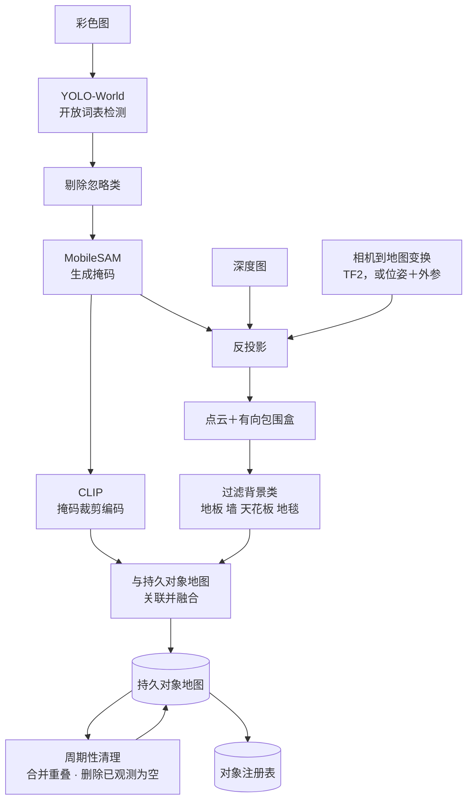

# 场景服务使用指南

本页说明如何把场景服务（Scene）部署到真实机器人或仿真环境。前置条件是 `rbnx boot` 可以拉起一个最小部署，并且机器人已有可用的定位与占据栅格（occupancy grid）。

内容依次是：服务边界、启动与自检、硬件对应哪一档语义能力、一次感知循环的内部步骤、对象与关系如何产生、部署配置、操作界面、资源占用与三种部署方式，最后是对象缺失或重复时如何定位原因。

接口清单、能力约定（Contract）的 ID 和载荷定义都在[场景理解接口页](../interface-catalog/system/scene.md)，这里不重复。

## 场景服务负责什么

场景服务订阅机器人的彩色图、深度图、位姿和占据栅格，维护一份对象级的环境模型，并通过能力约定回答关于它的查询。规划器问“椅子在哪里”，由场景服务给出地图坐标系下的位姿。

三类数据只存在于场景服务里：

- 对象注册表（object registry）：环境里有哪些对象，以它为准。
- 关系层（relation layer）：对象之间的空间关系和语义关系。
- 用户标注（user annotation）：人在地图上画的房间和兴趣点。这类信息目前由人手动标注，感知流水线不产生。

场景服务不做同步定位与建图（SLAM），度量定位和占据栅格都来自[空间地图服务](../interface-catalog/service/map.md)，它只负责消费。它也不做路径规划，`goal_near` 和 `goal_room` 只是把语义引用换算成规划器认识的目标位姿，再往下就不管了。

## 启动场景服务

场景服务是部署的一部分，由 `rbnx boot` 随整栈拉起，不单独启动。以仓库自带的 Webots 演示为例：

```bash
# 构建镜像。这一步会拉 torch 与感知模型权重，第一次比较久
cd system/scene && bash scripts/build.sh

# 起仿真（Webots + 底盘 + 相机 + 雷达）
cd ../../examples/webots && bash sim/start.sh

# 起整栈：atlas、executor、pilot、三个原语、场景、建图、导航、探索
export DISPLAY=:0
rbnx boot
```

启动后按以下顺序确认服务已就绪：

```bash
# 1. 场景服务在能力注册表里，且是 ACTIVE
rbnx caps | grep scene

# 2. 操作界面能打开
curl -s -o /dev/null -w "%{http_code}\n" http://127.0.0.1:50107/

# 3. 智能体能看到它的工具
rbnx tools | grep scene
```

日志在部署目录的 `rbnx-boot/logs/scene.log`。启动时有两行必看：`perception plan:` 说明定档结果与接上的输入，`ConceptGraphsDetector started` 说明检测器就绪。两行之间的时间差就是激活耗时，x86 上实测约 12.6 秒。

对象要靠机器人走动才会出现。让规划器跑探索技能：

```bash
rbnx ask "thoroughly explore the entire room, and wait for explore to finish"
```

## 硬件决定能跑到哪一档

场景服务按相机类输入是否接上，把能力分成三档，不看性能。档位名就是启动日志里 `tier=` 的取值：

| 档位 | 输入 | 检测器 | 智能体可以问什么 |
|---|---|---|---|
| `metric` | 彩色图 + 深度图 | ConceptGraphs | 对象级三维语义、空间关系、开放词表查询 |
| `visual` | 只有彩色图 | 视觉语言模型（VLM） | 区域级语义，对象位置粗略 |
| `geometric` | 都没有 | 无 | 只有占据栅格与 `goal_near` |

内参（intrinsics）、位姿和外参（extrinsics）不参与定档。它们缺失时下降的是 grounding 的质量，不是档位。但 `metric` 档缺少内参时会持续等待，不会自行假定一个相机矩阵。当前档位见启动日志中的这一行：

```text
tier=... detector=... grounding=... inputs=[...]
```

## 一次感知循环做了什么

`metric` 档默认每 0.6 秒执行一次。每一拍都完整跑完下面九步，不会因为画面变化不大就跳过某一拍，所以 GPU 占用是持续的，不随机器人是否移动而变。周期由 `SCENE_DETECT_PERIOD_S` 控制。



1. YOLO-World 在配置的开放词表上给出候选框。
2. 先剔除忽略类，再做分割，因为分割是最贵的一步。
3. MobileSAM 为每个保留的框生成掩码。
4. CLIP 把每个掩码裁剪编码成特征向量。
5. 掩码结合深度图反投影成地图坐标系下的点云和有向包围盒，所用的相机到地图变换优先取自 TF2，其次由位姿加校验过的外参组合。
6. 背景类（地板、墙、天花板、地毯）和只落在地面上的检测被过滤掉。
7. 剩下的检测与持久对象地图做关联并融合。
8. 周期性清理：合并重叠对象，删除“旧位置已经被明确观测为空”的对象。
9. 把该对象地图的当前状态投射回对象注册表。

## 对象如何建立、合并与消失

这一节决定了实际效果，调参也集中在这里。

<strong>关联</strong>按类别与坐标系分桶，在类内做匈牙利最小代价匹配，代价是三维欧氏距离加上置信度惩罚，超出逐类门限半径的配对直接判为不可匹配。匹配上的对象用指数滑动平均更新位姿，未匹配的检测建立新对象。

这里有一个必须知道的后果：**关联是类别严格的**。同一把椅子这一帧被认成 `chair`、下一帧被认成 `couch`，就会产生两个对象。这是重复对象的主要来源，也是 `SCENE_CG_MERGE_CLASS_GROUPS` 存在的原因。

<strong>合并</strong>有两条通路。逐帧合并处理同一物体被拆成多条记录的情况；周期性合并有三个独立判据，可以分别开关：类无关的几何塌缩（只看包围盒交并比与包含关系）、点云重叠加视觉相似度、同类近邻距离。三者的阈值都是环境变量，见下面的配置表。

<strong>消失</strong>分两级。软驱逐把记录标记为 `missing` 并释放它与后端的绑定，`SCENE_OBJECT_TTL_SEC` 之内重新看到可以复用原来的对象 ID 和观测计数；超过之后硬删除。另有一条独立通路：当一个对象的旧位置当前就在视野里而且是空的，它会被直接移除。

### 对象注册表与场景图的更新频率不同

这两层的时间尺度差一个数量级，混淆它们会导致对下游行为的错误预期。

| | 对象注册表 | 场景图 |
|---|---|---|
| 更新周期 | 0.6 秒（`SCENE_DETECT_PERIOD_S`） | 30 秒（`SCENE_GRAPH_INTERVAL_SEC`） |
| 由什么驱动 | 每一帧感知 | 独立的后台循环 |
| 内容 | 对象及其位姿、包围盒、观测计数 | 节点与关系边 |

**对象注册表是高频动态的。** 它每 0.6 秒被上面这条流水线刷新一次，内容随机器人移动、视角变化和检测抖动持续变化：对象会新建、被合并、被软驱逐（`missing`）、超过 `SCENE_OBJECT_TTL_SEC` 后硬删除。同一张桌子在相邻两拍里的包围盒和 `observation_count` 都可能不同。

**场景图相对稳定。** 它的节点来自对象注册表，但不跟着每拍重建，而是由一个独立的后台循环按 30 秒的周期重新推理。参与建图的对象还要先满足 `SCENE_GRAPH_MIN_OBSERVATIONS`（默认 2）次观测，单拍的误检进不来。每轮最多处理 `SCENE_GRAPH_MAX_OBJECTS`（默认 80）个对象和 `SCENE_GRAPH_MAX_CANDIDATE_EDGES`（默认 200）条候选边。

两者相差 50 倍，这个差距是有意的：关系推理要调模型，成本远高于一次检测，而“杯子在桌子上”这类关系本来也不会每 0.6 秒变一次。

对这两层提问的方式也不同：问“现在看得见什么”查对象注册表，问“A 在不在 B 上面”查场景图。

## 关系分两层

这两层是分开的，部署时可以只用第一层。

几何关系循环以 3 Hz 运行，只依据几何产生接触、包含与可达性边。它不需要模型、不需要网络、不需要任何凭据，规划器依赖它在启动后数秒内可用。

场景图构建器（scene graph builder）额外产生基于图像 grounding 的语义边。它需要视觉语言模型（VLM）的接口地址与密钥。缺少密钥时它记录一行日志，关系统一返回 `unknown`，几何层不受影响。新部署不启用这一层也能正常运行。

## 部署配置

场景服务的配置分两处：部署清单（manifest）里的 `config` 块，和环境变量。清单字段优先于同名环境变量。

### 清单字段

```yaml
system:
  scene:
    manifest: package_manifest.yaml
    config:
      map_id: office
      observations:
        - kind: rgb
          topic: /camera/color/image_raw
          type: sensor_msgs/msg/Image
        - kind: depth
          topic: /camera/depth/image_rect_raw
          type: sensor_msgs/msg/Image
      camera_provider_id: tiago_camera
      camera_frame: camera_color_optical_frame
      base_frame: base_link
      pose_max_age_s: 2.0
      web_port: 50107
```

| 字段 | 含义 |
|---|---|
| `observations` | 逻辑输入种类到 ROS 2 话题与消息类型的映射。`kind` 取 `rgb`、`depth`、`lidar2d`、`pose`、`odom` 等 |
| `camera_provider_id` | 相机提供方的实例名，即部署清单里该原语的 `name`（例如 `tiago_camera`），不是软件包标识 `com.robonix.*`。彩色图、深度图、内参、外参必须来自同一台物理相机，这个字段把它们钉在同一个提供方上 |
| `camera_frame` | 相机光学坐标系名。不配置时按 TF 树解析，解析不出来就停止输出而不是猜 |
| `base_frame` | 机身坐标系名，与本体模型（Soma）声明的值核对 |
| `pose_max_age_s` | 用于相机到世界投影的位姿最大接收年龄，超龄样本会让检测被扣住不发布 |
| `map_id` | 地图身份的静态回退值。建图服务广播 `robonix/service/map/lifecycle` 时以广播为准 |
| `intrinsics_fallback` | 仿真部署显式选用的内参回退，需要经过评审。不配置时缺内参就等待 |
| `web_port` | 操作界面端口，设为 `0` 关闭界面 |

### 环境变量

按用途分组，只列部署时真正会调的。完整清单在 `system/scene/README.md`。

**感知模型与词表**

| 变量 | 默认值 | 含义 |
|---|---|---|
| `SCENE_OPEN_VOCAB_CLASSES` | 55 项默认表 | 逗号分隔的开放词表。检测器只能用给定的名字作答，把词表换成部署现场真实存在的类别，是目前实测收益最大的一处改动 |
| `SCENE_DETECT_PERIOD_S` | `0.6` | 检测周期。与语音等其他 GPU 任务共用一张卡时调大它 |
| `SCENE_CG_FORCE_CPU` | 空 | 置 `1` 强制 CPU，约慢三倍 |
| `SCENE_CLIP_MODEL` / `SCENE_CLIP_PRETRAINED` | `ViT-B-32` / 本地权重 | 特征编码模型 |
| `SCENE_PERCEPTION_WAIT_S` | `30` | 等待相机提供方的秒数，超时后按当时可见的输入定档 |

**合并与去重**

| 变量 | 默认值 | 含义 |
|---|---|---|
| `SCENE_CG_SAME_CLASS_MERGE_DIST_M` | `0.4` | 同类近邻合并距离，不看视觉相似度。对付“一个键盘变三个”。设 `0` 关闭 |
| `SCENE_CG_MERGE_CLASS_GROUPS` | 空 | 易混类归组，例如 `chair,table,desk;sofa,couch`。同组内的标签抖动会被折叠，组外互不影响。空值表示永不跨类改名 |
| `SCENE_CG_CROSS_CLASS_IOU_THRESH` | `0.30` | 周期性类无关塌缩的包围盒交并比阈值，调低更激进 |
| `SCENE_CG_CROSS_CLASS_OVERLAP_THRESH` | `0.50` | 同上，一个框被另一个包含的比例阈值 |
| `SCENE_CG_MERGE_OVERLAP_THRESH` / `SCENE_CG_MERGE_VISUAL_SIM_THRESH` | `0.50` / `0.65` | 点云重叠且 CLIP 余弦相似度同时达标才合并 |
| `SCENE_CG_OBJ_MIN_POINTS` | `20` | 周期清理的最小点数。键盘这类薄物体反投影后点很稀，调高会把它们一起删掉 |
| `SCENE_OBJECT_TTL_SEC` | `30` | 软驱逐对象的保留时长，决定对象 ID 在短暂遮挡后能否复用 |

**关系层**

| 变量 | 默认值 | 含义 |
|---|---|---|
| `SCENE_GRAPH_IMAGE_RELATIONS` | `true` | 用一次基于图像 grounding 的模型调用产生关系边。置 `false` 或拿不到相机帧时回退到逐对文本推理 |
| `SCENE_GRAPH_IMAGE_MAX_DIM` | `960` | 送给模型的标注图长边像素上限，直接决定图像 token 开销 |
| `VLM_REASONING_EFFORT` | 未设置 | 设置后转发给所有场景模型调用。未设置时字段整个不出现，不影响非推理模型 |

**界面、持久化与地图绑定**

| 变量 | 默认值 | 含义 |
|---|---|---|
| `SCENE_WEB_HOST` | `0.0.0.0` | 操作界面绑定地址。界面没有鉴权，机器人在共享网络上时设为 `127.0.0.1` |
| `SCENE_WEB_PORT` | `50107` | 操作界面端口 |
| `SCENE_OBJECT_MEMORY_DB` | `/data/robonix/scene_memory/objects.db` | 对象快照数据库路径，容器内路径由宿主挂载 |
| `SCENE_ANNOTATIONS_DIR` | `/data/robonix/scene_annotations` | 用户标注按地图分文件存放的目录 |
| `SCENE_RESTORE_ON_START` | 未设置 | 显式选择启动时热恢复对象。默认每次启动都是新的实时会话 |
| `SCENE_MAP_ID` | `default` | 地图身份回退值，优先级低于清单 `map_id`，两者都低于建图服务的广播 |
| `SCENE_MAP_BINDING_WAIT_S` | `3.0` | 启动探测等待生命周期约定出现的秒数，`0` 关闭探测 |

## 操作界面怎么用

界面在 `SCENE_WEB_PORT`（默认 50107），四个页面各自回答一个问题。它们都不需要智能体在运行，是排查感知问题最快的入口。

| 页面 | 路径 | 回答什么 |
|---|---|---|
| 二维地图 | `/2d` | 对象和机器人画在占据栅格上，判断对象有没有落在它该在的房间里 |
| 三维视图 | `/3d` | 对象点云与包围盒，判断几何是否合理 |
| 相机 | `/cam` | 感知流水线<strong>实际收到</strong>的彩色图与深度图，带编码与时间戳 |
| 标注与地图 | `/user` | 画房间、保存与加载地图、纠正定位 |


新部署一个对象都没有时，先开相机页：页面上有图就说明相机链路通，问题在检测；页面空白或标题里的时间戳不再前进，问题在相机或 TF。

### 保存一张地图

一次保存会写两部分数据，分别由两个服务负责：

- 建图服务写**地图本身**：占据栅格、点云和 RTAB-Map 数据库，也就是[建图与定位](./mapping.md)里那个已保存地图目录。
- 场景服务写**这张地图上的语义**：你画的房间，以及当前对象快照。

两者用同一个 Map ID 关联，所以加载时能一起恢复。

1. 打开 `/user`。顶部状态区显示当前地图的 Map ID；还没保存过的实时会话显示 `unsaved live`。
2. 在 **Map ID** 里填一个名字，例如 `office_3f`。之后 `goal_room` 这类查询只在这个 ID 的范围内找房间。
3. 点 **Save current**。成功后状态行给出写入结果和房间数量。

用同一个 Map ID 再点一次 Save current，**地图本身不会被覆盖**，只更新房间和对象，界面会提示该地图已存在。想重建地图，先删掉再重新保存。

这个限制是有意的。机器人定位错了的时候画面看起来仍然正常，如果这时保存能覆盖，一张好地图就被毁了，而且没法恢复。

### 加载一张地图并纠正定位

1. 在 `/user` 的地图列表里点目标地图的 **Load**。
2. 界面依次执行四步并显示进度：校验地图文件是否完整、把建图服务切到定位模式、等待一张新的占据栅格、恢复房间与对象。
3. 加载完成后如果机器人在地图上的位置明显不对，点 **Pose estimate**，按钮会变成 `Click pose on map`，再在地图上点机器人实际所在的位置。

加载之后房间与对象都归属于同一个 Map ID，不需要额外操作。

### 手工标注房间

房间目前由人手动标注，感知流水线不产生房间。

1. 在 `/user` 点 **✏ Annotate room**，按钮变成 `✕ Cancel drawing`。
2. 在地图上依次点击房间的各个角点，至少三个。
3. <strong>双击</strong>或按 **Enter** 结束，按 **Esc** 取消。
4. 在右侧列表里给它命名。

地图重建（`generation` 提升）之后房间不会被删除，而是标为过期并显示成黄色，同时出现提示横幅。逐个确认仍然有效点 **Still valid**，位置变了就重画。房间由人工标注产生，系统只做标记，不会自动删除。

完整的界面语义规则，包括地图不可覆盖与过期标记的处理，在[场景理解接口页](../interface-catalog/system/scene.md)。

## 硬件要求

**尚未确定。** 场景服务目前只在一台开发机上有完整实测数据，还没有在多种平台上系统测过，因此本页不给出最低配置。要在 Debian 与 syswonder 小车上补测之后再填。

现有的唯一一组实测数据，仅供参考它的量级，不要当作要求：

| 项目 | 实测值 | 测量条件 |
|---|---|---|
| 显存 | 3.9 GB | RTX 2060 6 GB，`lite` 档（YOLO-World + MobileSAM + CLIP ViT-B-32） |
| 显卡占用 | 约 37% | 同上，仿真办公室场景巡场 |
| CPU | 约一个核 | 每 0.6 秒一拍，每拍都跑完检测、分割、编码 |
| 容器常驻内存 | 启动 1.2 GB，五分钟后 2.8 GB | 同上 |

这里有一处**尚未定位的内存异常**。同一条巡场路线上，有一次容器常驻内存在一个采样周期（5 秒）内从 2.8 GB 涨到 22.0 GB，维持约两分钟后随容器重启回落。该增长是突发的，不是缓慢累积。原因尚未定位，当前的主要怀疑对象是周期性合并，它会把两团点云拼接后重新处理。嵌入式平台的内存与系统共享，一次这样的增长足以让整机终止，因此移植前应先复现并修复。

## 三种部署方式

场景服务是唯一与平台相关的 Robonix 系统组件。Rust 系统二进制是一份静态构建，场景服务带着一整套 CUDA 感知栈。

| 部署方式 | 清单 | torch 来源 | 怎么跑 |
|---|---|---|---|
| x86 容器（默认） | `package_manifest.yaml` | 镜像内置 cu128 wheel | `docker run --gpus all` |
| Jetson 容器 | `package_manifest.jetson-docker.yaml` | jetson-ai-lab wheel | `docker run --runtime nvidia` |
| Jetson 原生 | `package_manifest.jetson-native.yaml` | 宿主 JetPack torch | 宿主 `python3 -m scene_service.service` |

多数 Jetson 上推荐原生路径，它复用 JetPack 的 CUDA 栈，不必构建数 GB 的 L4T 镜像。宿主依赖的安装命令在 `system/scene/README.md`。

## 定位常见问题

**启动后界面打不开，进程仍在运行。** 生命周期激活（`CMD_ACTIVATE`）有 90 秒上限。x86 上从感知计划打印到检测器就绪实测 12.6 秒，其中 YOLO-World 约 5 秒、CLIP 约 1 秒，余量很大。超时几乎都是被某个外部资源阻塞，而不是模型加载慢：用日志里 `perception plan:` 到 `ConceptGraphsDetector started` 两行的时间差判断。上一次部署没有完全退出、端口仍被占用，是最常见的一种。调大 `ROBONIX_DRIVER_INIT_TIMEOUT_S` 只会把问题推后，不要用它绕过。

**一个对象都没有。** 按顺序看三处：启动日志的 `tier=` 行是不是 `geometric`；相机页有没有图；日志里有没有周期性的检测计数行。`metric` 档缺内参时会一直等待，这是设计行为，日志里会说明。

**对象重复。** 先看重复的两条记录类别是否不同。不同就属于标签抖动，用 `SCENE_CG_MERGE_CLASS_GROUPS` 把这两个类归组；相同就调 `SCENE_CG_SAME_CLASS_MERGE_DIST_M`。两者都不要调过头，合并过激会把两个相邻的真实物体折叠成一个。

**对象位置整体偏移。** 检查相机到地图的变换来源。TF 树完整时走 TF；只有位姿加外参时，任何一处标定误差都会整体搬运所有对象。启动日志的 `grounding=` 字段是 `degraded` 就说明走的是回退路径。

**建图回环后对象留在原地。** 这是已知缺陷，当前没有实现修复。重建地图后用标注页确认或重画房间，对象会随重新观测重建。
