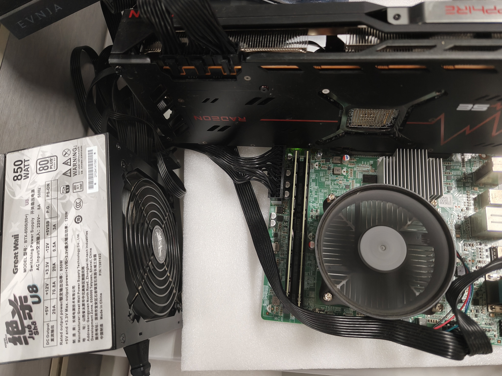
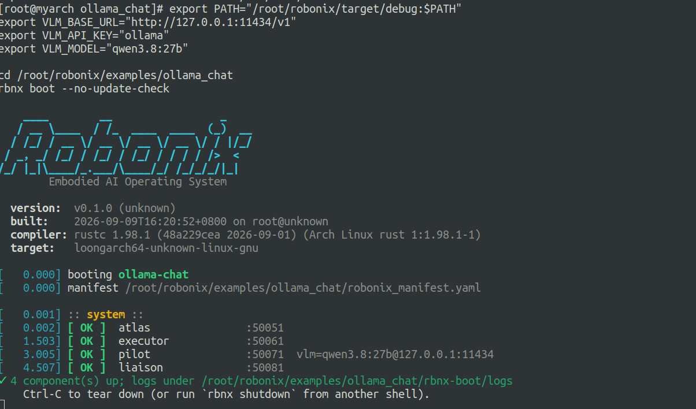
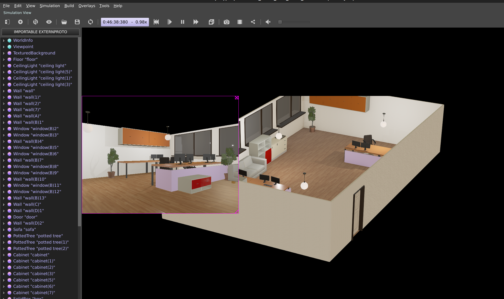
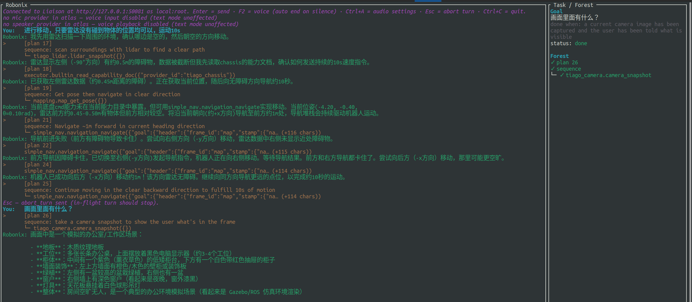

# x86 Ubuntu 仿真 + LoongArch Arch Linux 本地推理完整部署流程

本文档描述以下拓扑的完整部署流程：

```text
x86 Ubuntu          : Webots 仿真 + 设备驱动 + mapping + simple_nav
LoongArch Arch 3A6000: Robonix 大脑 (Atlas/Executor/Pilot/Liaison) + Ollama(qwen3.8:27b, AMD GPU)
```

示例 IP：

```text
x86    = 192.168.100.1
3A6000 = 192.168.100.10
```

按你实际 IP 替换。

---

## 一、总体结构

```text
3A6000 (192.168.100.10)
├── Ollama 服务        127.0.0.1:11434  (qwen3.8:27b)
└── rbnx boot
    ├── Atlas          0.0.0.0:50051   ← x86 驱动注册到这里
    ├── Executor       127.0.0.1:50061
    ├── Pilot          127.0.0.1:50071  → 调用 Ollama
    └── Liaison        127.0.0.1:50081

x86 (192.168.100.1)
├── Webots 容器  robonix_tiago_sim
├── tiago_camera / tiago_lidar / tiago_chassis
├── mapping (robonix-mapping 容器)
└── simple_nav
```

<<<<<<< HEAD
=======
3A6000 实机：板载 AMD GPU，本地跑 Ollama 推理。



>>>>>>> 217b887 (docs: add the x86 simulation + LoongArch deployment guide)
---

## 二、3A6000 上：编译 + 安装 Robonix

### 1. 依赖

Arch Linux：

```bash
sudo pacman -S --needed base-devel git protobuf rust
rustc --version
cargo --version
protoc --version
```

要求 Rust 至少 1.85，能支持 `edition 2024`。

### 2. 获取代码 + 子模块

```bash
cd /root
git clone --recursive <你的-robonix-地址> robonix
cd /root/robonix

# 下面三条是相对路径，必须在 robonix 仓库根目录执行；
# 如果在 capabilities/lib/xxx 之类的子目录里执行，会拼成错误路径并报 No such file
pwd   # 应该是 /root/robonix

# 至少确保这三个子模块存在
ls capabilities/lib/common_interfaces/geometry_msgs/msg/Pose.msg
ls capabilities/lib/rcl_interfaces/rcl_interfaces/msg/Parameter.msg
ls capabilities/lib/unique_identifier_msgs/unique_identifier_msgs/msg/UUID.msg

# 如果不确定当前目录，或已经 cd 到别处，直接用绝对路径最稳：
ls /root/robonix/capabilities/lib/common_interfaces/geometry_msgs/msg/Pose.msg
ls /root/robonix/capabilities/lib/rcl_interfaces/rcl_interfaces/msg/Parameter.msg
ls /root/robonix/capabilities/lib/unique_identifier_msgs/unique_identifier_msgs/msg/UUID.msg
```

如果缺失：

```bash
cd /root/robonix/capabilities/lib

git clone https://github.com/enkerewpo/common_interfaces common_interfaces
git -C common_interfaces checkout --detach 0ecd0f70791fe200f057b12bfc626beb21bad639

git clone https://github.com/enkerewpo/rcl_interfaces rcl_interfaces
git -C rcl_interfaces checkout --detach 5afc90af2e217f83813935130bdfe74f46aa96bb

git clone https://github.com/ros2/unique_identifier_msgs unique_identifier_msgs
git -C unique_identifier_msgs checkout --detach 27767cefcf8a80da44641dc208c57722c28aa11c
```

### 3. LoongArch protoc 补丁

`protoc-bin-vendored` 没有 loongarch64 二进制，需要让 build.rs 用系统 protoc。

```bash
cd /root/robonix
python3 - <<'PY'
from pathlib import Path

files = [
    Path("system/atlas/build.rs"),
    Path("system/soma/build.rs"),
    Path("system/vitals/build.rs"),
    Path("system/liaison/build.rs"),
    Path("system/executor/build.rs"),
    Path("system/pilot/build.rs"),
    Path("tools/rbnx/build.rs"),
]

old = "    let protoc = protoc_bin_vendored::protoc_bin_path()?;\n"
new = """    // Prefer a system protoc when present (needed on architectures like
    // LoongArch where protoc-bin-vendored does not ship a binary).
    let protoc = std::env::var_os("PROTOC")
        .map(PathBuf::from)
        .map(Ok)
        .unwrap_or_else(protoc_bin_vendored::protoc_bin_path)?;
"""

for f in files:
    s = f.read_text()
    if old not in s:
        raise SystemExit(f"old not found in {f}")
    f.write_text(s.replace(old, new))
    print("patched", f)
PY
```

### 4. 编译 + install

```bash
cd /root/robonix

export PROTOC=/usr/bin/protoc
export CARGO_BUILD_JOBS=1

make install
rbnx setup /root/robonix

export PATH="$HOME/.cargo/bin:$PATH"
rbnx --version
```

如果 `make install` 太慢或并行编译不稳定，也可以用 debug 版本：

```bash
cd /root/robonix
export PROTOC=/usr/bin/protoc
cargo build --workspace -j1
export PATH="/root/robonix/target/debug:$PATH"
rbnx setup /root/robonix
```

---

## 三、3A6000 上：启动 Ollama（AMD GPU 本地推理）

### 1. 确认 Ollama + 模型

```bash
ollama list
```

确保有：

```text
qwen3.8:27b
```

没有就：

```bash
ollama pull qwen3.8:27b
```

### 2. 保持模型常驻显存

```bash
export OLLAMA_KEEP_ALIVE=24h
ollama serve
```

或者 systemd：

```bash
sudo systemctl edit ollama
```

加入：

```ini
[Service]
Environment="OLLAMA_KEEP_ALIVE=24h"
```

然后：

```bash
sudo systemctl restart ollama
```

### 3. 验证 GPU 推理

```bash
ollama ps
```

如果显示 `PROCESSOR` 里有 GPU，说明 AMD GPU 生效。

### 4. 预热模型

```bash
curl -s http://127.0.0.1:11434/v1/chat/completions \
  -H "Content-Type: application/json" \
  -d '{
    "model": "qwen3.8:27b",
    "messages": [{"role": "user", "content": "Reply OK"}],
    "stream": false
  }'
```

---

## 四、3A6000 上：启动 Robonix 大脑

创建 manifest：

```bash
mkdir -p /root/robonix/examples/ollama_webots
cat > /root/robonix/examples/ollama_webots/robonix_manifest.yaml <<'EOF'
manifestVersion: 1
name: ollama-webots-remote-core

system:
  atlas:
    listen: 0.0.0.0:50051
    log: info
  executor:
    listen: 127.0.0.1:50061
    log: info
  pilot:
    listen: 127.0.0.1:50071
    log: info
    vlm:
      upstream: ${VLM_BASE_URL}
      api_key: ${VLM_API_KEY}
      model: ${VLM_MODEL}
      api_format: openai
  liaison:
    listen: 127.0.0.1:50081
    log: info
EOF
```

启动：

```bash
cd /root/robonix/examples/ollama_webots
export PATH="$HOME/.cargo/bin:$PATH"

export VLM_BASE_URL="http://127.0.0.1:11434/v1"
export VLM_API_KEY="ollama"
export VLM_MODEL="qwen3.8:27b"
export ROBONIX_PILOT_VLM_IDLE_TIMEOUT_SECS=300

rbnx boot --no-update-check
```

保持这个终端开着。

<<<<<<< HEAD
=======
启动效果（Atlas / Executor / Pilot / Liaison 全部拉起）：



>>>>>>> 217b887 (docs: add the x86 simulation + LoongArch deployment guide)
---

## 五、x86 Ubuntu 上：安装与启动 Webots

### 1. 依赖

```bash
sudo apt update
sudo apt install -y \
  git curl build-essential python3 python3-pip \
  docker.io docker-compose-v2 x11-apps

# Rust
curl --proto '=https' --tlsv1.2 -sSf https://sh.rustup.rs | sh
source "$HOME/.cargo/env"

# uv
curl -LsSf https://astral.sh/uv/install.sh | sh
export PATH="$HOME/.local/bin:$HOME/.cargo/bin:$PATH"
```

### 2. NVIDIA 容器运行时（有 NVIDIA GPU）

```bash
sudo apt install -y nvidia-container-toolkit
sudo nvidia-ctk runtime configure --runtime=docker
sudo systemctl restart docker
```

没有 NVIDIA runtime 就先用 CPU：

```bash
ROBONIX_FORCE_CPU=1 bash examples/webots/sim/start.sh --tiago-variant lite
```

### 3. 安装 rbnx

```bash
cd ~/3A6000/robonix
git submodule update --init capabilities/lib/common_interfaces \
  capabilities/lib/rcl_interfaces capabilities/lib/unique_identifier_msgs

cargo install --path tools/rbnx
rbnx setup ~/3A6000/robonix
export PATH="$HOME/.cargo/bin:$PATH"
rbnx --version
```

### 4. 启动 Webots

```bash
cd ~/3A6000/robonix
bash examples/webots/sim/start.sh --tiago-variant lite
```

确认容器：

```bash
docker ps | grep robonix_tiago_sim
```

<<<<<<< HEAD
=======
x86 Ubuntu 22.04 上的 Webots 仿真效果：



>>>>>>> 217b887 (docs: add the x86 simulation + LoongArch deployment guide)
---

## 六、x86 上：构建并启动驱动

先设置公共环境：

```bash
cd ~/3A6000/robonix

export ROBONIX_SIM_CONTAINER=robonix_tiago_sim
export ROBONIX_SIM_ATLAS=192.168.100.10:50051
export ROBONIX_ADVERTISE_HOST=192.168.100.1
export RMW_IMPLEMENTATION=rmw_zenoh_cpp
```

### 1. 构建驱动

```bash
rbnx build -p examples/webots/primitives/tiago_camera
rbnx build -p examples/webots/primitives/tiago_lidar
rbnx build -p examples/webots/primitives/tiago_chassis
rbnx build -p examples/webots/services/simple_nav
```

### 2. 启动 camera

```bash
RBNX_INSTANCE_NAME=tiago_camera rbnx start \
  -p examples/webots/primitives/tiago_camera \
  --endpoint 192.168.100.10:50051
```

### 3. 启动 lidar

```bash
RBNX_INSTANCE_NAME=tiago_lidar rbnx start \
  -p examples/webots/primitives/tiago_lidar \
  --endpoint 192.168.100.10:50051
```

### 4. 启动 chassis

```bash
RBNX_INSTANCE_NAME=tiago_chassis rbnx start \
  -p examples/webots/primitives/tiago_chassis \
  --endpoint 192.168.100.10:50051
```

> 每条都保持前台运行，或用 tmux。

---

## 七、x86 上：启动 mapping

### 1. 配置

！！！！注意将下面的params_file换为实际的绝对路径！！！。

```bash
cat > ~/3A6000/robonix/examples/webots/mapping.yaml <<'EOF'
use_sim_time: true
occupancy_sources: [lidar, depth]
params_file: /home/boneinscri/3A6000/robonix/examples/webots/config/rtabmap_params.yaml

sensor_providers:
  lidar2d: tiago_lidar
  rgb: tiago_camera
  depth: tiago_camera
  odom: tiago_chassis
EOF
```

### 2. 获取 + 构建 mapping

```bash
mkdir -p ~/3A6000/robonix/examples/webots/rbnx-boot/cache
cd ~/3A6000/robonix/examples/webots/rbnx-boot/cache
git clone https://github.com/syswonder/service-map-rbnx

cd service-map-rbnx
export PATH="$HOME/.cargo/bin:$PATH"

docker tag robonix-osrf-ros:humble-desktop-full robonix-ros:humble-ros-base || true
rbnx build -p .
```

如果缺 `grpcio-tools`：

```bash
pip install grpcio-tools
```

### 3. 启动 mapping

```bash
cd ~/3A6000/robonix/examples/webots/rbnx-boot/cache/service-map-rbnx

export RBNX_INSTANCE_NAME=mapping
export RBNX_INVOCATION_CWD=/home/boneinscri/3A6000/robonix/examples/webots
export ROBONIX_ATLAS=192.168.100.10:50051
export ROBONIX_ADVERTISE_HOST=192.168.100.1
export RMW_IMPLEMENTATION=rmw_zenoh_cpp

rbnx start \
  -p /home/boneinscri/3A6000/robonix/examples/webots/rbnx-boot/cache/service-map-rbnx \
  --endpoint 192.168.100.10:50051 \
  --config /home/boneinscri/3A6000/robonix/examples/webots/mapping.yaml
```

等出现 `Driver(CMD_ACTIVATE) → mapping ok`。

---

## 八、x86 上：启动 simple_nav

先确认 `simple_nav/scripts/start.sh` 已经打了 advertise host 补丁：

```bash
grep -n "ADVERTISE_HOST" \
  ~/3A6000/robonix/examples/webots/services/simple_nav/scripts/start.sh
```

应该看到：

```text
ADVERTISE_HOST="$(resolve_advertise_host)"
-e ROBONIX_ADVERTISE_HOST="$ADVERTISE_HOST"
```

启动：

```bash
cd ~/3A6000/robonix

export RBNX_INSTANCE_NAME=simple_nav
export ROBONIX_SIM_CONTAINER=robonix_tiago_sim
export ROBONIX_SIM_ATLAS=192.168.100.10:50051
export ROBONIX_ADVERTISE_HOST=192.168.100.1
export RMW_IMPLEMENTATION=rmw_zenoh_cpp

rbnx start -p examples/webots/services/simple_nav \
  --endpoint 192.168.100.10:50051
```

顺序必须是：

```text
camera -> lidar -> chassis -> mapping -> simple_nav
```

---

## 九、验证

在 3A6000 上：

```bash
export PATH="$HOME/.cargo/bin:$PATH"
rbnx caps --server 127.0.0.1:50051
```

预期：

```text
● tiago_camera  [ACTIVE]
● tiago_lidar   [ACTIVE]
● tiago_chassis [ACTIVE]
● mapping       [ACTIVE]
● simple_nav    [ACTIVE]
```

`simple_nav` 的 endpoint 必须是：

```text
http://192.168.100.1:xxxxx/mcp/
```

不能是 `127.0.0.1`。

然后：

```bash
rbnx tools --server 127.0.0.1:50051
rbnx chat
```

测试：

```text
看看前面有什么
向后移动0.2米
```

<<<<<<< HEAD
=======
`rbnx chat` 的交互效果：



>>>>>>> 217b887 (docs: add the x86 simulation + LoongArch deployment guide)
---

## 十、可选：Scene

如果需要“去厨房 / 去桌子旁边”这类语义导航，再在 x86 上构建并启动 Scene：

```bash
cd ~/3A6000/robonix/system/scene
export PATH="$HOME/.cargo/bin:$PATH"
rbnx build -p .

export RBNX_INSTANCE_NAME=scene
export ROBONIX_ATLAS=192.168.100.10:50051
export ROBONIX_ADVERTISE_HOST=192.168.100.1
export RMW_IMPLEMENTATION=rmw_zenoh_cpp
export ROBONIX_SCENE_FORCE=docker

rbnx start -p . --endpoint 192.168.100.10:50051
```

Scene 比较重，不是必需项。

---

## 常见坑

1. 3A6000 编译必须：

   ```bash
   export PROTOC=/usr/bin/protoc
   ```
   否则 `protoc-bin-vendored` 没有 loongarch64 二进制。
2. 子模块必须补齐，否则报 `Pose.msg` 找不到。
   检查时注意相对路径：`ls capabilities/lib/...` 只能在 `/root/robonix` 根目录执行；
   如果当前在 `capabilities/lib/xxx` 等子目录里执行，会拼成错误路径。
   不确定当前目录时，用绝对路径：`ls /root/robonix/capabilities/lib/...`。
3. Atlas 重启后，x86 上所有 provider 都要重新注册。
4. `simple_nav` 必须晚于 `mapping` 启动，否则报 `missing map_topic`。
5. `simple_nav` 的 `ROBONIX_ADVERTISE_HOST` 必须是 x86 的局域网 IP。
6. Qwen3.8 27B 是 thinking 模型，建议：

   ```bash
   export ROBONIX_PILOT_VLM_IDLE_TIMEOUT_SECS=300
   ```
7. Ollama 建议：

   ```bash
   export OLLAMA_KEEP_ALIVE=24h
   ```
   避免每次都重新加载 27B 参数到 GPU。
