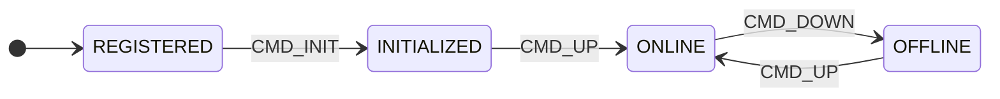
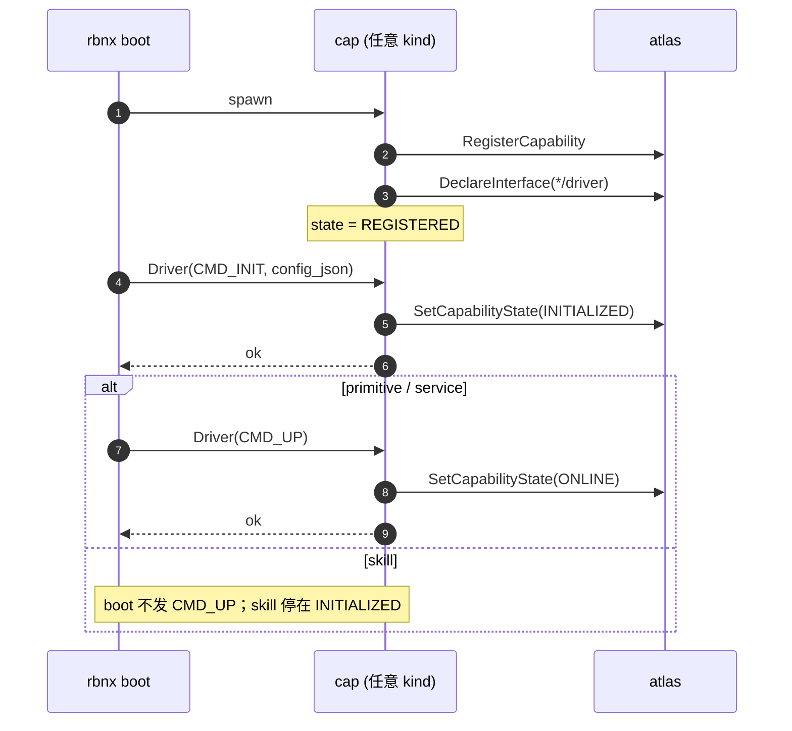
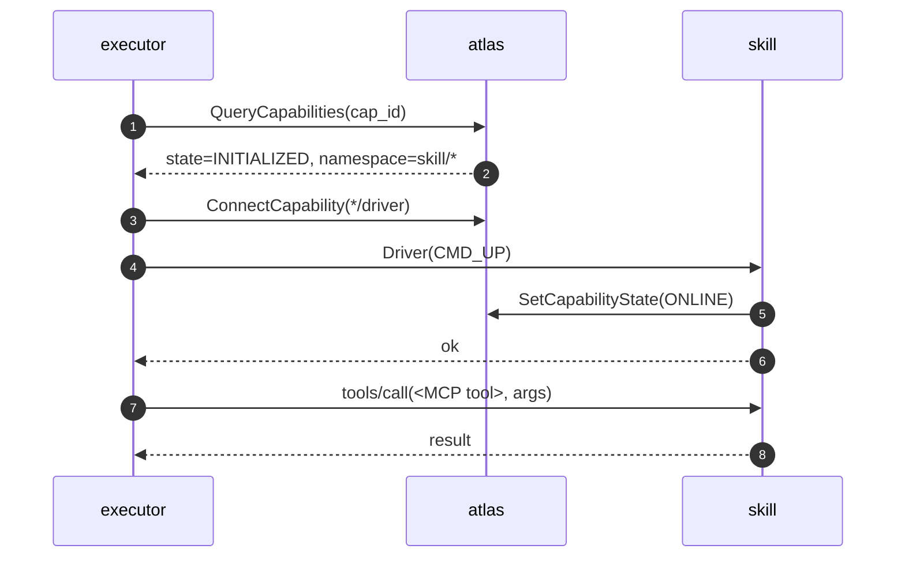

# 能力生命周期与状态机

每个 Robonix 能力（capability）运行时处于五个状态之一。状态由能力进程自己上报到 Atlas（通过 `SetCapabilityState` RPC），Atlas 只缓存最新值。`rbnx caps` 输出里方括号中的标签就是这个值。

## 状态

| 状态 | 含义 |
|---|---|
| `REGISTERED`  | 进程已启动、`RegisterCapability` 完成，但还没收到 / 还没处理完 `Driver(CMD_INIT)`。 |
| `INITIALIZED` | `Driver(CMD_INIT)` 返回 `ok=true`；配置已解析，依赖已查好，但还没占用热资源。 |
| `ONLINE`      | `Driver(CMD_UP)` 返回 `ok=true`；正在对外提供服务。 |
| `OFFLINE`     | `Driver(CMD_DOWN)` 返回 `ok=true`；只对 skill 有意义 —— gRPC 服务端和 Atlas 注册都保留，但 `on_up` 申请的资源已释放。 |
| `ERROR`       | 上一次 `Driver(CMD_*)` 返回 `ok=false` 或抛出异常。 |

## 状态机



两条横向规则之外的全局边：

- 任意状态收到 `Driver(CMD_SHUTDOWN)` 或 SIGTERM → 进程终止。
- 任意 `Driver(CMD_*)` 返回 `ok=false` 或抛出异常 → 进入 `ERROR`，之后只能再收 `Driver(CMD_SHUTDOWN)`。

## 谁触发哪条边

能力 TOML 里的 `kind` 字段目前只取 `primitive` / `service` / `skill` 三种。

| 边 | 触发者 | 何时 |
|---|---|---|
| `REGISTERED → INITIALIZED` | `rbnx boot` | 启动该能力时 |
| `INITIALIZED → ONLINE`（primitive、service） | `rbnx boot` | 紧接着 `CMD_INIT` 后自动发 `CMD_UP` |
| `INITIALIZED → ONLINE`（skill） | Executor | 第一次有 MCP 调用路由到这个 skill 时 |
| `ONLINE → OFFLINE`（skill） | Executor（淘汰策略） | 未来淘汰策略判定该 skill 冷却时（**当前未实现**，sticky 不降级） |
| `OFFLINE → ONLINE`（skill） | Executor | 进入 OFFLINE 后再次收到 MCP 调用 |
| `→ 终止` | `rbnx shutdown` / SIGTERM | 拆栈 |

唯一的差别在 skill：`rbnx boot` 阶段停在 `INITIALIZED`，进 `ONLINE` 是 Executor 按需触发的；primitive 和 service 在 boot 完成时已经处于 `ONLINE`。

## 启动顺序



## Skill on-demand



executor 进程内维护 `cap_id → "已 UP"` 的 sticky set：第一次调某 skill 时走完整 UP 流程，之后直接跳到 `tools/call`，避免每次都付一次 driver-RPC 的延迟。eviction 算法（LRU / idle timeout / 内存压力）会发 `CMD_DOWN` 把冷 skill 降到 OFFLINE 释放资源 —— 这部分**目前没实现**，先 sticky 占着。

## 写 skill 的最小骨架

```python
from robonix_api import Capability

cap = Capability(id="com.robonix.skill.foo", namespace="robonix/skill/foo")
ctrl = None

@cap.on_init
def init(cfg):
    # 轻：parse cfg、检查 atlas 依赖
    return cap.ready()

@cap.on_up
def up(cfg):
    # 重：申请资源 —— 这里才起线程 / 加载模型
    global ctrl
    ctrl = MyController()
    ctrl.start()
    return cap.ready(state="online")

@cap.on_down
def down():
    global ctrl
    if ctrl is not None:
        ctrl.stop()
        ctrl = None
    return cap.ready(state="offline")

@cap.mcp("robonix/skill/foo/run")
def run(req):
    return Run_Response(...)  # 调用时 executor 已经替我们发过 CMD_UP
```

Skill 必须实现 `@cap.on_up` 和 `@cap.on_down`；缺一个 `Driver(CMD_UP/CMD_DOWN)` 直接返回 ok=false。primitive 和 service 的 `on_up` / `on_down` 是可选的 —— 没写就视为 no-op success（它们的真实初始化都在 `on_init` 里完成，`CMD_UP` 只是把状态推过最后一档）。

## 排错

| 现象 | 检查 |
|---|---|
| MCP call 返回 "controller not initialized" / skill 卡 INITIALIZED | skill 是否声明 `*/driver` capability TOML？executor 是否能 ConnectCapability 到它的 driver？|
| `rbnx caps` 里 cap 一直是 REGISTERED | 看 `<manifest-dir>/rbnx-boot/logs/<component>.log`，确认 driver gRPC server 起来 + boot 的 ConnectCapability 没报错 |
| `INITIALIZED → ONLINE` 转换失败 | `rbnx caps --json` 看 `state_detail`；包内日志 grep `CMD_UP` |
| Skill 一旦 OFFLINE 就再也用不起来 | 当前 executor sticky set 不会因 OFFLINE 自动清；临时绕路：重启 executor 进程。等 eviction 落地一起修。 |
