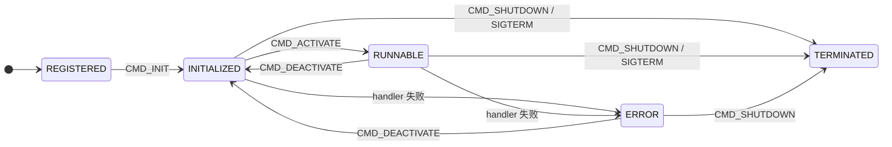
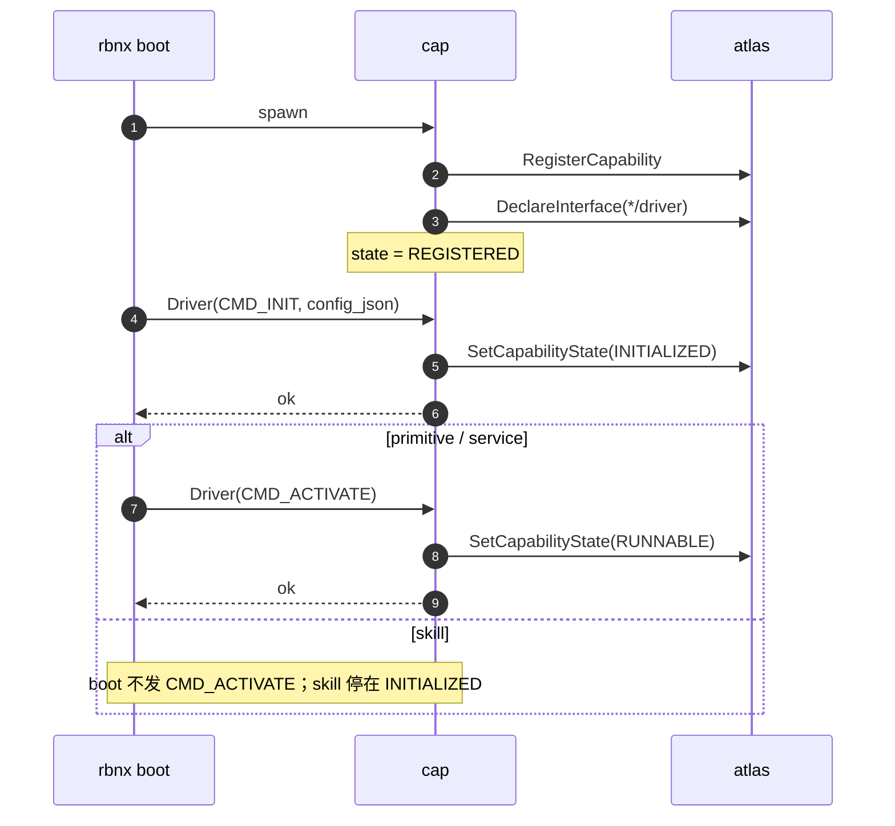
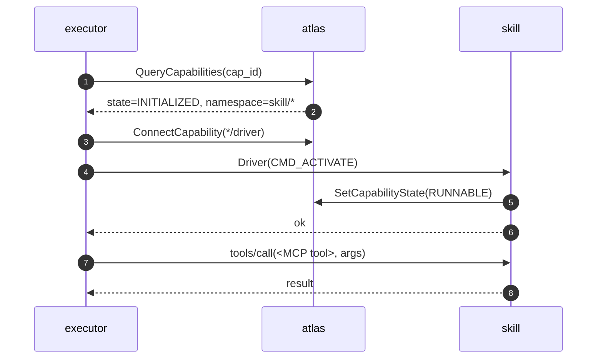

# 能力生命周期与状态机

每个 Robonix 能力（capability）运行时处于五个状态之一。状态由能力进程自己上报到 Atlas（通过 `SetCapabilityState` RPC）；Atlas 端做软校验（非法跳转写日志但仍接受），按 cap 缓存最新值。`rbnx caps` 输出方括号中的标签就是这个值。

## 状态

| 状态 | 含义 |
|---|---|
| `REGISTERED`  | 进程已启动、`RegisterCapability` 完成；还没收到 / 还没处理完 `Driver(CMD_INIT)`。 |
| `INITIALIZED` | `Driver(CMD_INIT)` 返回 `ok=true`；配置已解析、依赖已查好，**没有占用热运行资源**。 |
| `RUNNABLE`    | `Driver(CMD_ACTIVATE)` 返回 `ok=true`；持有热资源，正在对外提供服务。Consumer **必须** 看到此状态才能调用数据接口。 |
| `ERROR`       | 上一次 `Driver(CMD_*)` 返回 `ok=false` 或抛出异常。Consumer 不应再调；只能通过 `CMD_DEACTIVATE`（尝试回 INITIALIZED）或 `CMD_SHUTDOWN` 退出。 |
| `TERMINATED`  | `on_shutdown` 已运行、或进程退出、或 atlas 心跳超时。Atlas 短期保留记录用于事后排错，到期 GC。 |

`SUSPENDED`（pause/resume）不在 v0.1，留到 v0.2。

## 状态机



全局边：

- 任意非 `TERMINATED` 状态收到 `Driver(CMD_SHUTDOWN)` / SIGTERM → `TERMINATED`，进程退出。
- 任意 `Driver(CMD_*)` 返回 `ok=false` 或抛异常 → `ERROR`。
- Atlas 心跳长时间没刷（默认 90s）→ atlas 强制把 cap 标 `TERMINATED`、丢掉它的 channel；再过 600s GC 掉记录。

## Driver 命令

`Driver.srv` 在 `lib/lifecycle/srv/Driver.srv` 定义：

```
uint8 CMD_INIT       = 0
uint8 CMD_ACTIVATE   = 1
uint8 CMD_DEACTIVATE = 2
uint8 CMD_SHUTDOWN   = 3
```

## 谁触发哪条边

`kind` 只有 `primitive` / `service` / `system` / `skill` 四种。

| 边 | 触发者 | 何时 |
|---|---|---|
| `REGISTERED → INITIALIZED` | `rbnx boot` | 启动该能力时 |
| `INITIALIZED → RUNNABLE`（primitive、service） | `rbnx boot` | 紧接 `CMD_INIT` 后自动发 `CMD_ACTIVATE` |
| `INITIALIZED → RUNNABLE`（system，无 driver contract） | 框架自动 | gRPC + MCP 端口起来即推 `RUNNABLE` |
| `INITIALIZED → RUNNABLE`（skill） | Executor | 首次 MCP 调用路由到该 skill 时 |
| `RUNNABLE → INITIALIZED`（skill） | Executor | 闲置淘汰策略 `EXECUTOR_EVICTION_POLICY=deactivate`（**v0.1 默认 off**，sticky 保持 RUNNABLE） |
| `→ TERMINATED` | `rbnx shutdown` / SIGTERM / 心跳超时 | 进程退出 / atlas eviction |

唯一的差别在 skill：`rbnx boot` 阶段停在 `INITIALIZED`，进 `RUNNABLE` 是 Executor 按需触发的；primitive/service/system 在 boot 完成时已经处于 `RUNNABLE`。

## 启动顺序



## Skill on-demand



Executor 进程内维护 `cap_id → "已 ACTIVATE"` 的 sticky set：第一次调某 skill 时走完整 ACTIVATE 流程，之后直接跳到 `tools/call`，避免每次都付一次 driver-RPC 的延迟。

`EXECUTOR_EVICTION_POLICY=deactivate` 打开后，后台 task 周期检查 in-flight=0 且 idle 超过阈值的 skill，发 `CMD_DEACTIVATE` 释放资源。**v0.1 默认 off**（保留 sticky 行为）。

## Config 投递

cap 通过 `@cap.on_init(cfg)` 接收 config —— `cfg` 是 `Driver(CMD_INIT, config_json)` 解析后的 dict，由 rbnx 推过来。来源两个：

- `rbnx boot`：deploy manifest 该 entry 的 `config:` 段
- `rbnx start --config <file> / --set k.v=val`：CLI 单包测试用

```python
@cap.on_init
def init(cfg: dict):
    sensors = cfg.get("sensors", {})
    if not isinstance(sensors, dict) or not sensors:
        return cap.error("missing sensors block in config")
    # ... use cfg ...
    return cap.ready()
```

跨语言 cap：实现 `*/driver` gRPC 服务、把 `Driver_Request.config_json` 反序列化成本语言的 dict 即可。

## 写 skill 的最小骨架

```python
from robonix_api import Capability

cap = Capability(id="com.robonix.skill.foo", namespace="robonix/skill/foo")
ctrl = None

@cap.on_init
def init(cfg):
    # 轻：parse cfg、检查 atlas 依赖
    return cap.ready()

@cap.on_activate
def activate(cfg):
    # 重：申请资源 —— 这里才起线程 / 加载模型
    global ctrl
    ctrl = MyController()
    ctrl.start()
    return cap.ready()

@cap.on_deactivate
def deactivate():
    global ctrl
    if ctrl is not None:
        ctrl.stop()
        ctrl = None
    return cap.ready()

@cap.mcp("robonix/skill/foo/run")
def run(req):
    return Run_Response(...)  # 调用时 executor 已经替我们发过 CMD_ACTIVATE
```

Skill **必须**实现 `@cap.on_activate` 和 `@cap.on_deactivate`；缺一个，对应的 `Driver(CMD_*)` 直接返回 `ok=false`，executor 看到错误就不会路由请求。primitive 和 service 的 `on_activate` / `on_deactivate` 是可选的 —— 没写就视为 no-op success（它们的真实初始化都在 `on_init` 里完成，`CMD_ACTIVATE` 只是把状态推过最后一档）。

可选：`@cap.on_shutdown` 在 `Driver(CMD_SHUTDOWN)` 或 SIGTERM 时跑；返回值忽略。日志、状态文件最后一次 flush 写在这里。

## 排错

| 现象 | 检查 |
|---|---|
| MCP call 返回 "controller not initialized" / skill 卡 INITIALIZED | skill 是否声明 `*/driver` capability TOML？executor 是否能 ConnectCapability 到它的 driver？|
| `rbnx caps` 里 cap 一直是 REGISTERED | 看 `<manifest-dir>/rbnx-boot/logs/<component>.log`，确认 driver gRPC server 起来 + boot 的 ConnectCapability 没报错 |
| `INITIALIZED → RUNNABLE` 转换失败 | `rbnx caps --json` 看 `state_detail`；包内日志 grep `CMD_ACTIVATE` |
| skill 一直没 ACTIVATE | executor sticky set 还不知道 skill 在 atlas 里出现了；执行任意一次 `rbnx chat` 调到该 skill 即可触发 |
| atlas 显示某 cap `TERMINATED` 但进程其实还活着 | 心跳没刷到 atlas（>90s）；检查网络、`heartbeat` 线程是否被阻塞 |
