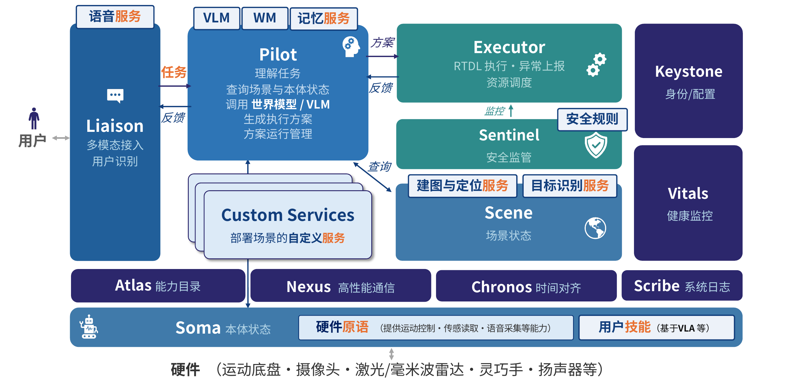

# 系统组件

[toc]

Robonix 将操作系统职责拆分为 **12 个系统组件**，每个组件在 `system/<name>/` 下有独立目录与 README。

本页描述的是 **dev 分支当前真实的实现状态**——哪些已落地、哪些还是 stub——而不是白皮书的目标蓝图。

## 总体架构与运行流程

Robonix 以 **能力（capability）** 为统一抽象。每个能力由 **契约（contract）** 定义：ROS IDL 描述其输入输出，契约同时指定通信模型（请求响应、单向输出流）与承载（gRPC、ROS 2、MCP）。调用方不依赖具体组件，而是按 `contract_id` 经 Atlas 查询能力、解析 endpoint 后调用。能力由三类提供者实现：原语 `primitive`、服务 `service`、技能 `skill`。

### 任务流转

一次任务是 Pilot 驱动的多轮闭环。

1. **Liaison** 接收文本或语音输入。语音链路经声纹完成识别与准入，将输入封装为 **Task** 提交给 Pilot，并以事件流向用户回传过程与结果。
2. **Pilot** 每轮以 Scene 的场景状态、Soma 的本体描述与对话历史为上下文调用 VLM，生成一棵 RTDL 动作树，展平为 **Plan** 提交给 Executor。
3. **Executor** 解释 RTDL 算子（`sequence`、`parallel`、`do`），按 `contract_id` 经 Atlas 定位 provider 并调用能力。每次调用前由 **Sentinel** 依规则校验放行。同步能力直接返回终态，异步能力轮询 `status` 至终态；执行事件流式回传 Pilot。
4. Pilot 依执行结果进入下一轮规划，直至 VLM 返回空方案，任务结束。

### 三个层次

- **基础设施**：Atlas（能力注册与发现）、Nexus（gRPC、MCP、ROS 2 通信）、Chronos（统一时钟与源头时间戳）、Scribe（结构化日志）。所有系统组件共用。
- **支撑服务**：Keystone（用户身份、偏好、准入）、Vitals（电源与部件健康）。由 Pilot、Sentinel、Liaison 按需查询。
- **本体层**：Soma 提供与厂商无关的本体描述；`primitive` 将厂商 SDK 封装为统一能力（底盘、机械臂、相机、雷达、音频）；`skill` 封装模型类能力，如 VLA 动作策略。

## 12 个组件

| 组件 | 负责 | 状态 | 实现 |
|------|------|------|------|
| **atlas** | 能力发现 / 目录 | 已实现 | Rust（`system/atlas`） |
| **chronos** | 统一时间 / PTP 对齐 | stub | `system/chronos`（仅 README） |
| **executor** | 方案编排与能力分发 | 已实现 | Rust（`system/executor`） |
| **keystone** | 身份 / 配置 / 策略 | stub | `system/keystone` |
| **liaison** | 人机交互（chat / 语音 / TUI） | 已实现 | Rust（`system/liaison`） |
| **nexus** | gRPC / MCP / ROS 2 通信库的集合 | 库，非独立进程 | 现有 gRPC/MCP/ROS 2；未来加自研 ROS 2 零拷贝 |
| **pilot** | 规划 / 决策 / 记忆 / 世界模型 | 已实现 | Rust（`system/pilot`） |
| **scene** | 场景状态 / 语义地图 / 对象注册表 | 已实现 | Python（`system/scene`） |
| **scribe** | 结构化日志 / 回放 / 审计 | stub | `system/scribe` |
| **sentinel** | 安全监督 | 内嵌 executor（v0.1） | `system/sentinel` |
| **soma** | 本体结构与运行状态汇总 | 已实现 | Rust（`system/soma`） |
| **vitals** | 健康快照 / 模块健康 | 已实现 | Rust（`system/vitals`） |

## 实现 vs stub

当前部署会独立启动 **atlas / executor / soma / vitals / pilot / liaison**（Rust 二进制，`make install` 安装）和 **scene**（Python 服务）。另外两个组件不是独立进程：

- **nexus**：不是进程，而是一套通信库的集合——gRPC、MCP、ROS 2 的客户端/服务端实现，每个组件直接链接使用（能力约定就投影到这三种 transport 上）。规划中还包括自研的 ROS 2 零拷贝库。它不是"待实现的 stub"，而是已经在用的那套传输代码。
- **sentinel**：安全监督作为 executor 的子模块跑（在能力分发链路上拦截），还没拆成独立组件。
其余 **chronos / keystone / scribe** 仍处于占位或早期开发阶段。Soma 已从 `soma.yaml`、完整 URDF 与 provider 能力读取本体结构，并汇总底盘、关节、夹爪等运行状态；Vitals 独立汇总系统与模块健康。两者职责不同：Pilot 查询 Soma 获取本体事实，查询 Vitals 获取健康事实。

## 与能力约定层的关系

system 组件里对外暴露能力约定的有 pilot / executor / liaison / scene / soma / vitals。atlas 使用自己的 gRPC 控制面（不是能力约定，见 [Atlas 能力目录](atlas.md)）。

启动顺序见 [系统部署与启动流程](deployment-and-startup.md)。
