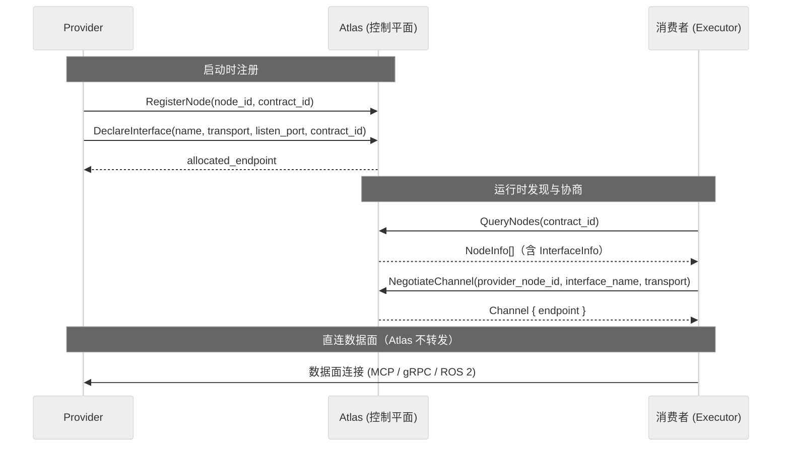

# 命名空间与接口模型

Robonix 采用树形命名空间统一管理硬件能力与系统服务。每个注册节点占据树上一个位置，每个接口对应一个稳定的契约 ID（与 `rust/contracts` 中 `[contract] id` 一致）。命名空间与 ROS 2 topic 名称无关，后者属于传输层实现细节。

完整设计稿见 `rust/docs/NAMESPACE.md`。

## 命名空间树

所有节点的 `RegisterNode.namespace` 均以 `robonix/` 开头，第二段标识域：

| 域 | 用途 |
|----|------|
| `prm` | 物理机器人、仿真及虚拟硬件的能力抽象（底盘、相机、机械臂等） |
| `srv` | 系统服务（Liaison / Pilot / Executor，Robonix OS 本身的一部分，不可替换）与用户服务（认知、记忆、地图、数据采集、系统监控等，部署到系统之上；常用能力 Robonix 提供默认实现，用户可替换或扩展） |

`prm` 下按硬件类别细分为 `base`、`camera`、`sensor`、`arm`、`gripper`、`force_torque`。`srv` 下分两层：**系统服务**（Liaison / Pilot / Executor）构成 Robonix 的编排骨架，不可替换；**用户服务**（`cognition`、`memory`、`planning` 等）部署到系统之上，Robonix 对常用能力提供默认实现，用户可替换或新增。

## 契约 ID（`contract_id`）

契约 ID 是发现与校验时使用的稳定路径字符串，与 `rust/contracts/**/*.toml` 中 `[contract]` 节的 `id` 字段一致（例如 `robonix/srv/runtime/pilot`、`robonix/prm/camera/rgb`）。版本仅在 TOML 文件名及文件内容中维护，不拼入 `contract_id`。

在控制平面上：

- `DeclareInterfaceRequest.contract_id`：建议显式填写契约 ID。若留空，Atlas 按旧规则由 `RegisterNode.namespace` + `DeclareInterface.name` 推导（`namespace + "/" + name`），结果应与对应契约一致。
- `QueryNodesRequest.contract_id`：非空时按契约 ID 精确匹配接口，此时忽略 `namespace` / `name` 过滤（仍可配合 `transport`）。
- `InterfaceInfo.contract_id`：声明后解析得到的稳定路径，供客户端展示与匹配。

`rust/proto/robonix_runtime.proto` 中的相关片段：

```protobuf
message DeclareInterfaceRequest {
  string node_id = 1;
  string name = 2;
  repeated string supported_transports = 3;
  string metadata_json = 4;
  uint32 listen_port = 5;
  string contract_id = 6;   // 与 rust/contracts 中 [contract] id 一致；空则服务端推导
}

message QueryNodesRequest {
  string namespace = 1;
  string name = 2;
  string transport = 3;
  string distro_prefix = 4;
  string container_id = 5;
  string contract_id = 6;   // 非空时精确匹配 InterfaceInfo.contract_id
}

message InterfaceInfo {
  string name = 1;
  repeated string supported_transports = 2;
  string metadata_json = 3;
  string contract_id = 4;
}
```

旧代码中曾使用 `abstract_interface_id`，该字段已全部迁移为 `contract_id`，两者含义相同。

## 契约 TOML 与 `robonix_proto`

- `rust/contracts/**`：描述每个契约的通信形状（`[mode].type`：`rpc` / `rpc_server_stream` / `rpc_client_stream` / `topic_out` / `topic_in`）及 `[io]` 引用的 ROS 路径。文件按域分目录，例如 `rust/contracts/prm/base_move.v1.toml`、`rust/contracts/sys/pilot.v1.toml`；完整清单见[接口目录 · 契约源码路径](../interface-catalog/index.md#contract-toml-sources)与 `rust/contracts/README.md`。
- `rust/crates/robonix-interfaces/lib/**`：ROS 2 IDL（`.msg` / `.srv`），载荷与具体 `*Service` RPC 的权威定义。
- `robonix-codegen`：统一生成 `crates/robonix-interfaces/robonix_proto/*.proto`（含各包的 `*Service`）以及 `robonix_contracts.proto`（`package robonix.contracts`，按契约 ID 提供抽象的 `Stream` / `Call` 门面，便于目录化与工具链）。
- `robonix_proto/` 下文件全部由 robonix-codegen 生成，禁止手动修改；控制面专用 proto（如 `robonix_runtime.proto`）仍位于 `rust/proto/`。

典型生成命令（在 `rust/` 下）：

```bash
cargo run -p robonix-codegen -- --lang proto \
  -I crates/robonix-interfaces/lib \
  --contracts contracts \
  -o crates/robonix-interfaces/robonix_proto
```

具体命名 RPC（如 `PilotService.HandleIntent`、`ExecutorService.Execute`）由 `lib/<pkg>/srv` 生成；`robonix_contracts.proto` 中同一契约可能表现为泛型 `Stream(...)`，详见 `rust/contracts/README.md` 中"门面 vs 具体服务"一节。

## 多传输

同一个逻辑接口可以在不同传输上分别声明。例如 `tiago_bridge` 为 camera `rgb` 同时注册 gRPC（server-stream）和 ROS 2（topic republish）：

```python
# gRPC 声明
stub.DeclareInterface(DeclareInterfaceRequest(
    node_id=node_id, name="rgb",
    supported_transports=["grpc"],
    listen_port=prm_grpc_port,
    contract_id="robonix/prm/camera/rgb",
))

# ROS 2 声明
stub.DeclareInterface(DeclareInterfaceRequest(
    node_id=node_id, name="rgb",
    supported_transports=["ros2"],
    metadata_json="{}",
    listen_port=0,
    contract_id="robonix/prm/camera/rgb",
))
```

服务端允许同一节点上同名接口存在多条记录，只要传输类型不同。消费者在 `NegotiateChannel` 时通过 `transport` 字段选择所需传输。

## 系统接口目录

对 gRPC 与 ROS 2 传输，Atlas 维护系统接口目录（`ROBO_SYSTEM_INTERFACE_CATALOG`），仅允许目录中出现的契约 ID 注册，以防止未经设计的路径被使用。

MCP 传输不受此约束，工具名可自由定义。

目录中的路径应与 `rust/contracts` 及接口目录文档保持一致，例如：

```
robonix/prm/base/move, … /odom, …
robonix/prm/camera/rgb, … /depth, …
robonix/prm/sensor/imu, … /lidar, …
robonix/srv/cognition/reason, …
robonix/srv/memory/search, …
robonix/srv/runtime/pilot, executor, liaison, …
```

（完整列表以 Atlas 内嵌目录为准。）

## node_id

每个注册节点必须使用 reverse-DNS 格式的 `node_id`，至少三段。例如 `com.robonix.prm.tiago`、`org.example.vlm_service`。`node_id` 为空时，服务端自动分配 `com.robonix.ephemeral.<uuid>`。同一时刻不允许两个不同进程使用相同的 `node_id`。

## NegotiateChannel 流程



1. 调用 `QueryNodes`，通过 `contract_id` 或 `namespace` + `transport` 找到 provider。
2. 从 `NodeInfo.interfaces` 中选择目标接口与传输。
3. 调用 `NegotiateChannel`，传入 `consumer_id`、`provider_node_id`、`interface_name`、`transport`。
4. 使用返回的 `endpoint` 直接建立数据面连接。

通道使用完毕后调用 `ReleaseChannel`；节点执行 `UnregisterNode` 时，关联通道会自动释放。
