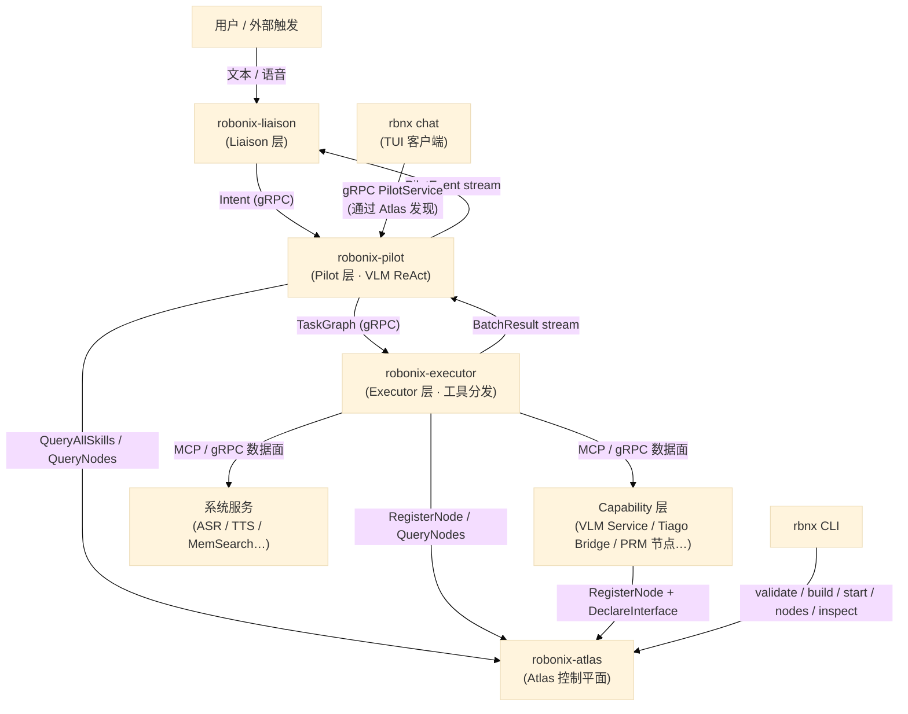

# 系统全景

Robonix 采用六层 EAIOS（Embodied AI Operating System）架构，分为控制平面和数据面两部分。控制平面负责"谁在哪里、能做什么"；数据面负责"实际通信、传数据"。

## 六层架构

| 层 | 组件 | 职责 |
|---|---|---|
| **Liaison** | `robonix-liaison` | 接收用户输入（文本/语音），构造 `Intent`，流式返回 `PilotEvent` |
| **Pilot** | `robonix-pilot` | VLM 驱动的 ReAct 推理循环，将意图分解为 **`TaskGraph`** 片段（语义为行为树；当前为线性 `TaskCall[]`，BT/RTDL 待重构） |
| **Executor** | `robonix-executor` | 接收 **`TaskGraph`**，按 v1 线性顺序分发到 builtin/MCP/gRPC 工具，流式返回结果 |
| **Atlas** | `robonix-atlas` | 控制平面：节点注册、接口声明、通道协商、技能库 |
| **Capability** | VLM Service、PRM 节点、tiago_bridge… | 具体能力提供者，向 Atlas 注册并暴露工具接口 |
| **System Services** | ASR、TTS、MemSearch… | 跨切面服务，同样通过 Atlas 注册 |

## 一次任务的完整链路

以用户输入 "find the door" 为例：

1. 用户在 `robonix-liaison`（或 `rbnx chat`）中输入指令
2. Liaison 构造 `Intent` 消息，通过 gRPC 发送给 Pilot 的 `PilotService.HandleIntent`
3. Pilot 调用 `executor.ListTools` 获取所有可用工具；从 Atlas 拉取 `SKILL.md` 注入系统 prompt
4. Pilot 将用户消息 + 历史 + 工具列表发送给 VLM（`VlmService.ChatStream`）
5. VLM 返回 `tool_calls`（例如 `get_camera_image`）
6. Pilot 将 tool_calls 打包为 **`TaskGraph`**（v1 等同有序调用列表），通过 gRPC 发送给 Executor
7. Executor 按工具路由（BUILTIN / MCP / gRPC）分发调用，流式返回 `TaskCallEvent`
8. Pilot 收到所有结果后将其追加到对话历史，再次调用 VLM 分析
9. VLM 决定下一步行动，**循环**直到任务完成（无 tool_calls = 终止）
10. Pilot 向 Liaison 推送最终 `FinalText` 事件，Liaison 显示给用户

每个 VLM 推理轮次生成一个 **`TaskGraph`** 片段，构成**增量任务图**：不预先规划完整行为树，而是逐轮生成、执行、反馈（全量 BT/RTDL 为后续工作）。

## 控制平面（Atlas）

`robonix-atlas` 是控制平面的唯一入口，提供 `RobonixRuntime` gRPC 服务（定义在 `rust/proto/robonix_runtime.proto`）。Provider 进程启动后通过 `RegisterNode` 注册自身，再通过 `DeclareInterface` 声明它能提供哪些接口、支持哪些传输方式。控制平面为每个接口分配数据面端点（端口、topic 名等）。

消费者（通常是 `robonix-executor`）通过 `QueryNodes` 发现符合条件的 provider，再通过 `NegotiateChannel` 获取数据面端点，随后直接与 provider 通信——控制平面不转发数据。

## 数据面

数据面的传输方式是可插拔的。同一个逻辑接口（如 `robonix/prm/camera/rgb`）可以同时在 gRPC 和 ROS 2 两种传输上声明，消费者在 `NegotiateChannel` 时指定自己想用哪种传输。目前支持的传输方式：

| 传输 | 端点格式 | 典型场景 |
|------|---------|---------|
| gRPC | `host:port` | VLM 服务、PRM camera 流式接口 |
| MCP | `host:port` (HTTP) 或 `stdio://cmd` | Tiago 桥接暴露工具给 Executor |
| ROS 2 | `/rbnx/ch/n<uuid>` | 容器内 ROS 节点间通信 |
| shared_memory | `/rbnx_shm_<uuid>` | 同主机高带宽数据（点云、图像） |

### 零拷贝缓冲区

对于 `shared_memory` 传输，Robonix 通过 `robonix-buffer` crate 提供系统级缓冲区管理。核心思路是**操作系统层统一拥有所有缓冲区**——CPU 共享内存和 GPU 显存。节点不直接管理共享内存或 CUDA pinning，而是向 `RobonixBufferManager` 申请。

缓冲区系统**不限于图像**——支持任何需要在进程间高带宽传输的连续数据：图像帧、LiDAR 点云、大模型 embedding 张量、体素网格、音频流、关节状态等。

- 生产者通过 `allocate()` 或 `allocate_raw()` 创建 POSIX SHM 段
- 消费者通过 `open()` 映射同一段物理内存，零拷贝读取
- 消费者可选择 GPU pin（`cudaHostRegister`），使 H2D 传输获得 PCIe 满带宽
- 跨进程 GPU 显存共享通过 CUDA IPC（`cudaIpcGetMemHandle` / `cudaIpcOpenMemHandle`）实现

控制平面通过 `NegotiateChannel` 返回的 `metadata_json` 传递缓冲区元数据（shape、format、CUDA IPC handle 等），消费者据此自动发现和连接数据源。

## 包管理

`rbnx` CLI 负责包的生命周期管理。每个包通过 `robonix_manifest.yaml` 描述其构建和启动方式。`rbnx validate` 检查 manifest 合法性，`rbnx build` 执行构建脚本，`rbnx start` 启动指定节点并在需要时向 Atlas 注册技能信息。

## SKILL.md 与技能库

SKILL.md 是面向 LLM 的行为描述文件。每个技能（如 `object_search_wander`）用 Markdown 编写，包含技能名称、适用场景、可用工具和行为规范。Pilot 启动时通过 `QueryAllSkills` RPC 获取所有已注册的技能描述，将其注入系统 prompt，VLM 据此决定在什么情况下使用哪些工具、以什么节奏交替感知和行动。

除了自然语言的 SKILL.md，Atlas 还预留了**结构化技能图（Skill Graph）**的扩展点——将 **`TaskGraph` / BT** 持久化为具名、机器可执行的技能，供 Pilot 直接下发而无需额外 VLM 推理（设计 TODO，待技能库团队实现）。
