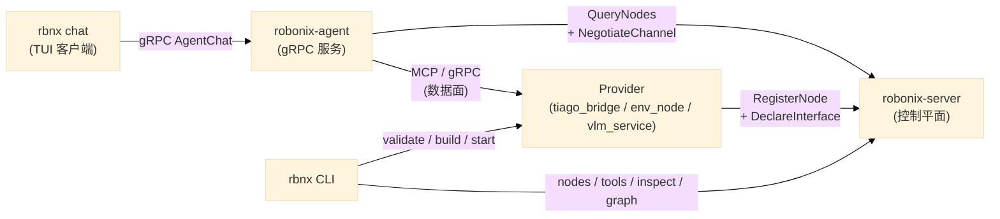

# 系统全景

Robonix 的架构分为控制平面和数据面两部分。控制平面负责"谁在哪里、能做什么"；数据面负责"实际通信、传数据"。

## 控制平面

`robonix-server` 是控制平面的唯一入口，提供一组 gRPC RPC（定义在 `rust/proto/robonix_runtime.proto` 中）。Provider 进程启动后通过 `RegisterNode` 注册自身，再通过 `DeclareInterface` 声明它能提供哪些接口、支持哪些传输方式。控制平面为每个接口分配数据面端点（端口、topic 名等）。

消费者（通常是 `robonix-agent`）通过 `QueryNodes` 发现符合条件的 provider，再通过 `NegotiateChannel` 获取数据面端点，随后直接与 provider 通信——控制平面不转发数据。

## 数据面

数据面的传输方式是可插拔的。同一个逻辑接口（如 `robonix/prm/camera/rgb`）可以同时在 gRPC 和 ROS 2 两种传输上声明，消费者在 `NegotiateChannel` 时指定自己想用哪种传输。目前支持的传输方式：

| 传输 | 端点格式 | 典型场景 |
|------|---------|---------|
| gRPC | `host:port` | VLM 服务、PRM camera 流式接口 |
| MCP | `host:port` (HTTP) | Tiago 桥接暴露工具给 Agent |
| ROS 2 | `/rbnx/ch/n<uuid>` | 容器内 ROS 节点间通信 |
| shared_memory | `/rbnx_shm_<uuid>` | 同主机高带宽数据（点云、图像） |

### 零拷贝缓冲区

对于 `shared_memory` 传输，Robonix 通过 `robonix-buffer` crate 提供系统级缓冲区管理。核心思路是**操作系统层统一拥有所有缓冲区**——CPU 共享内存和 GPU 显存。节点不直接管理共享内存或 CUDA pinning，而是向 `RobonixBufferManager` 申请。

缓冲区系统**不限于图像**——支持任何需要在进程间高带宽传输的连续数据：图像帧、LiDAR 点云、大模型 embedding 张量、体素网格、音频流、关节状态等。

- 生产者通过 `allocate()` 或 `allocate_raw()` 创建 POSIX SHM 段
- 消费者通过 `open()` 映射同一段物理内存，零拷贝读取
- 消费者可选择 GPU pin（`cudaHostRegister`），使 H2D 传输获得 PCIe 满带宽
- 跨进程 GPU 显存共享通过 CUDA IPC（`cudaIpcGetMemHandle` / `cudaIpcOpenMemHandle`）实现

控制平面通过 `NegotiateChannel` 返回的 `metadata_json` 传递缓冲区元数据（shape、format、CUDA IPC handle 等），消费者据此自动发现和连接数据源。详见[零拷贝缓冲区系统](buffer-system.md)。

## 一个请求的完整链路

以用户输入 "find the door" 为例，数据流经过以下路径：

1. 用户在 `rbnx chat` TUI 中输入指令
2. TUI 通过 gRPC 流式调用 `robonix-agent` 的 `AgentChat.Chat` RPC
3. Agent 将指令连同系统 prompt（包含 SKILL.md 和工具列表）发送给 VLM 服务（gRPC 数据面）
4. VLM 返回 tool_calls，例如 `get_camera_image`
5. Agent 通过 gRPC 流向 TUI 推送 `ToolCallInfo` 事件（TUI 实时显示工具调用进度）
6. Agent 通过 MCP 协议调用 Provider 的对应工具
7. Provider 返回结果，Agent 将结果追加到对话历史，再次调用 VLM 分析
8. VLM 决定下一步行动，循环继续直到任务完成
9. Agent 通过 gRPC 流向 TUI 推送 `final_text` 事件，TUI 显示最终回复

这一模型将 Agent 的日志输出与用户交互完全分离——Agent 作为后台 gRPC 服务运行，所有节点的 stderr 日志不会干扰 TUI 界面。

## 包管理

`rbnx` CLI 负责包的生命周期管理。每个包通过 `robonix_manifest.yaml` 描述其构建和启动方式。`rbnx validate` 检查 manifest 合法性，`rbnx build` 执行构建脚本，`rbnx start` 启动指定节点并在需要时向控制平面注册技能信息。

## SKILL.md

SKILL.md 是面向 LLM 的行为描述文件。每个技能（如 `object_search_wander`）用 Markdown 编写，包含技能名称、适用场景、可用工具和行为规范。Agent 启动时通过 `QueryAllSkills` RPC 获取所有已注册的技能描述，将其注入系统 prompt，VLM 据此决定在什么情况下使用哪些工具、以什么节奏交替感知和行动。
