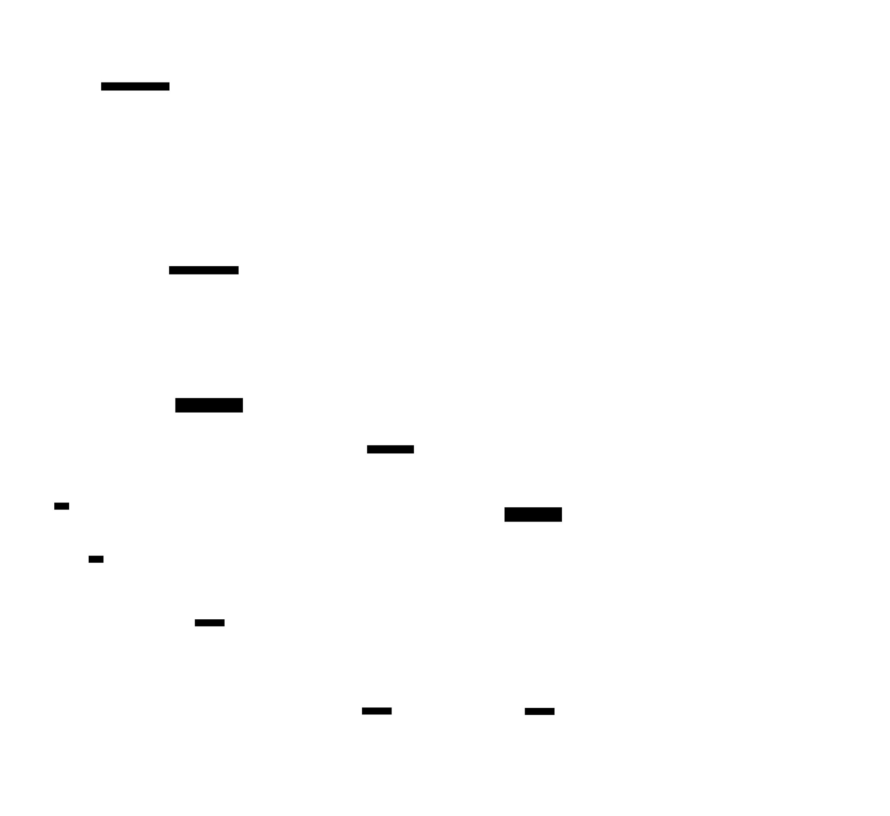
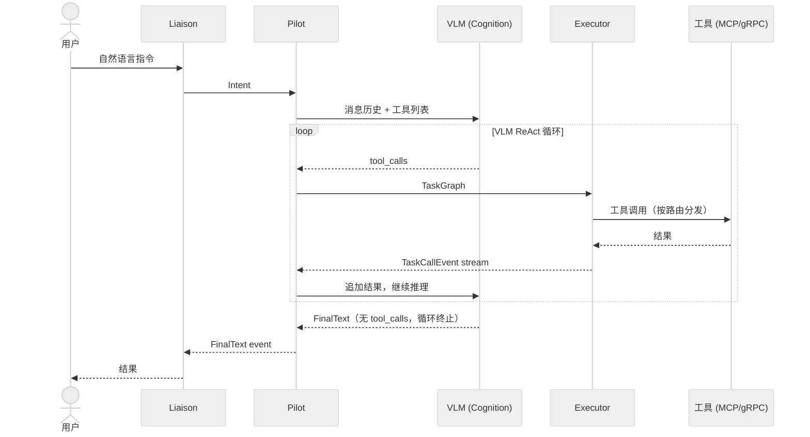

# 系统全景

## 系统架构

## 客户端与连接说明

四类客户端（CLI / GUI / 语音 / 机器人）均经由 Liaison 进入系统，Liaison 负责会话管理与界面适配。

- `rbnx chat` 当前直连 Pilot（`PilotService.HandleIntent`），属于调试过渡形态；长期目标是所有用户交互统一经由 Liaison。
- `rbnx` 其余只读子命令（`nodes` / `describe` / `tools` / `inspect` 等）永久直连 Atlas。Atlas 定位为注册中心与状态目录，CLI 作为状态监控工具直接查询 Atlas 是合理的。

## ReAct 推理循环

## 子系统

| 子系统 | crate | 职责 |
|---|---|---|
| Liaison | `robonix-liaison` | 接收用户输入（文本/语音），构造 `Intent`，流式返回 `PilotEvent`；内含会话管理与界面适配器（规划中） |
| Pilot | `robonix-pilot` | VLM 驱动的 ReAct 推理循环：将意图分解为 RTDL/`TaskGraph` 片段，向认知大模型发送意图并处理规划结果 |
| Executor | `robonix-executor` | 接收 RTDL/`TaskGraph`，按工具路由（Built-in / MCP / gRPC）分发调用，流式返回结果；包含 Skill Engine 与异常上报 |
| Atlas | `robonix-atlas` | 控制平面：节点注册、接口声明、通道协商、技能库 |
| 默认框架服务 | VLM Service、ASR、TTS、MemSearch 等 | 每个 Robonix 部署均应具备的基础服务（详见[框架服务](../interface-catalog/service/index.md)） |
| 场景工具 | Skill Nodes、Service Nodes、Primitive Nodes | 面向具体部署场景的技能、服务与硬件驱动节点，向 Atlas 注册并暴露工具接口 |

## 一次任务的完整链路

以用户输入 "find the door" 为例：

1. 用户在 `robonix-liaison`（或 `rbnx chat`）中输入指令。
2. Liaison 构造 `Intent` 消息，经 gRPC 发送至 Pilot 的 `PilotService.HandleIntent`。
3. Pilot 调用 `executor.ListTools` 获取所有可用工具，并从 Atlas 拉取 `SKILL.md` 注入系统 prompt。
4. Pilot 将用户消息、历史记录与工具列表发送至认知大模型（`CognitionService.Reason`，即 VLM）。
5. VLM 返回 `tool_calls`（例如 `get_camera_image`）。
6. Pilot 将 tool_calls 打包为 RTDL/`TaskGraph`——确定性结构，不含自然语言——经 gRPC 发送至 Executor。
7. Executor 按工具路由（Built-in / MCP / gRPC）分发调用，流式返回 `TaskCallEvent`。
8. Pilot 收到全部结果后将其追加至对话历史，再次调用 VLM 进行分析。
9. VLM 决定下一步行动；循环持续至任务完成（无 tool_calls 时终止）。
10. Pilot 向 Liaison 推送 `FinalText` 事件，Liaison 将结果展示给用户。

每一轮 VLM 推理对应一个独立的 `TaskGraph`，只包含 **这一轮 VLM 当下决定要执行的工具调用**。这些一次次的 `TaskGraph` 之间**互相独立**、没有任何边或依赖关系——Executor 执行完本轮的图就结束这一轮，VLM 重新拿到结果、重新推理，再生成新的一张图。举例：

- 用户说"打开门"。VLM 第一轮判断"我不知道怎么开门，先查技能库"，生成的 TaskGraph 只有 `read_skill("open_door")` 一个节点。
- 执行完、结果回到 VLM。第二轮 VLM 结合文档重新推理，生成的新 TaskGraph 里才有 `camera_snapshot`、`base_cmd`、`grasp` 等节点。
- 第二轮的图和第一轮的图没有任何连接——ReAct 状态完全存在于对话历史里，图本身每轮独立生成、独立执行。

> **TODO**：目前 VLM 通过 OpenAI chat-completions 的 `tool_calls` 列表返回当轮调用。这把每一轮的 TaskGraph 压扁成了一个**并列 tool call 列表**——没有顺序、分支、循环、条件等图结构。后续工作是让 VLM 按 Robonix 定义的 `TaskGraph` / RTDL 结构（支持顺序、并行、条件分支、行为树子结构等）返回当轮计划，Executor 按图语义执行，而不是按列表顺序串行调一遍。

### 认知层多角色展望

当前 Pilot 调用单一 VLM 服务（`robonix/srv/cognition/reason`）承担全部推理工作。长期设计目标是多模型分工的认知层：

- 推理模型（reason）：接收感知数据与用户意图，执行 CoT 推理与逻辑分析
- 世界模型（world，规划中）：预测环境状态变化，辅助规划决策
- 代码模型（code，规划中）：生成结构化 RTDL/TaskGraph 执行计划

各角色对应独立的 `robonix/srv/cognition/*` 契约，Pilot 依据场景调用不同后端。

## 控制平面（Atlas）

`robonix-atlas` 是控制平面的唯一入口，提供 `RobonixRuntime` gRPC 服务（定义于 `rust/proto/robonix_runtime.proto`）。Provider 进程启动后通过 `RegisterNode` 注册自身，再通过 `DeclareInterface` 声明所提供的接口及支持的传输方式；控制平面为每个接口分配数据面端点（端口、topic 名等）。

消费者（通常为 `robonix-executor`）通过 `QueryNodes` 发现符合条件的 Provider，再通过 `NegotiateChannel` 获取数据面端点，随后直接与 Provider 通信。控制平面不转发数据。

## 数据面

数据面传输方式可插拔。同一逻辑接口（如 `robonix/prm/camera/rgb`）可同时在 gRPC 与 ROS 2 两种传输上声明，消费者在 `NegotiateChannel` 时通过 `transport` 字段指定所需传输。当前支持的传输方式：

| 传输 | 端点格式 | 典型场景 |
|------|---------|---------|
| gRPC | `host:port` | VLM 服务、PRM camera 流式接口 |
| MCP | `host:port` (HTTP) 或 `stdio://cmd` | Tiago 桥接暴露工具给 Executor |
| ROS 2 | `/rbnx/ch/n<uuid>` | 容器内 ROS 节点间通信 |
| shared_memory | `/rbnx_shm_<uuid>` | 同主机高带宽数据（点云、图像）— **TODO**：尚未在真实场景中验证，`zero_copy_demo` 里跑通了 raw SHM，上层 transport 适配与 provider/consumer 的 view 交换未测 |

### 零拷贝缓冲区

对于 `shared_memory` 传输，Robonix 通过 `robonix-buffer` crate 提供系统级缓冲区管理。核心设计为由操作系统层统一管理所有缓冲区（包括 CPU 共享内存与 GPU 显存），节点不直接管理共享内存或 CUDA pinning，而是向 `RobonixBufferManager` 申请。

缓冲区系统不限于图像，支持任何需要在进程间高带宽传输的连续数据，包括图像帧、LiDAR 点云、大模型 embedding 张量、体素网格、音频流及关节状态等。

- 生产者通过 `allocate()` 或 `allocate_raw()` 创建 POSIX SHM 段
- 消费者通过 `open()` 映射同一段物理内存，零拷贝读取
- 消费者可选择 GPU pin（`cudaHostRegister`），使 H2D 传输获得 PCIe 满带宽
- 跨进程 GPU 显存共享通过 CUDA IPC（`cudaIpcGetMemHandle` / `cudaIpcOpenMemHandle`）实现

控制平面通过 `NegotiateChannel` 返回的 `metadata_json` 传递缓冲区元数据（shape、format、CUDA IPC handle 等），消费者据此自动发现并连接数据源。

## 包管理

`rbnx` CLI 负责包的生命周期管理。每个包通过 `robonix_manifest.yaml` 描述其构建与启动方式。`rbnx validate` 检查 manifest 合法性，`rbnx build` 执行构建脚本，`rbnx start` 启动指定节点并按需向 Atlas 注册技能信息。

## SKILL.md 与技能库

SKILL.md 是面向 LLM 的行为描述文件。每个技能（如 `object_search_wander`）以 Markdown 编写，包含技能名称、适用场景、可用工具与行为规范。Pilot 启动时通过 `QueryAllSkills` RPC 获取所有已注册的技能描述并注入系统 prompt，VLM 据此决定在何种场景下使用哪些工具，以及感知与行动的交替节奏。

除自然语言形式的 SKILL.md 外，Atlas 预留了结构化技能图（Skill Graph）扩展点——将 `TaskGraph` / BT 持久化为具名、机器可执行的技能，供 Pilot 直接下发而无需额外 VLM 推理（TODO）。
