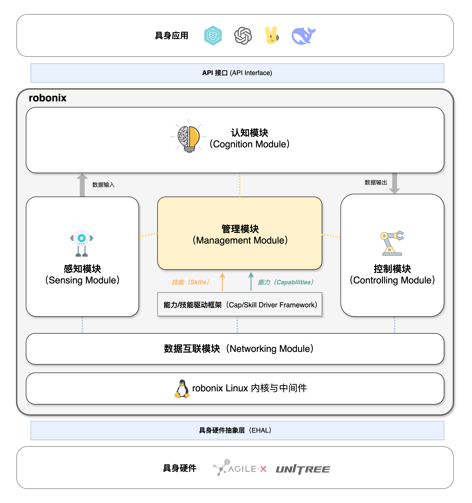
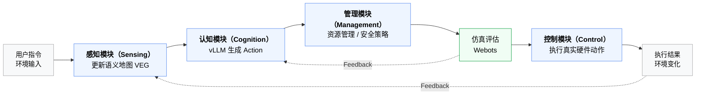

# robonix 系统架构设计

---
<!-- toc -->
---

> **具身智能**是指具身身体执行动作与环境交互，感知外部环境，并通过大脑进行持续学习、决策规划的能力。随着2023 年以来大语言模型与机器人的深度融合，基于视觉语言动作（Vision Language Model，VLA）模型的具身智能快速发展，然而目前的 VLA 存在一系列问题：
> 
> 1. 模型训练和具体的具身硬件绑定，更换底层硬件就会使得模型失效，需要重新训练；
> 2. 软件控制算法、驱动代码与硬件绑定，代码不具有可迁移性，难以复用。专家式地“面向ROS包编程”；
> 3. VLA 对执行复杂任务的支持不足，缺乏复杂任务规划能力；
> 4. 硬件能力与资源无法共享，具身应用存在相互影响的现象（*例如大语言模型的推理会导致 SLAM 运行缓慢导致任务失败*）。
> 

为了解决目前具身智能系统中所出现的相关问题，Syswonder 社区开发了面向多场景的模块化具身智能操作系统—— robonix，代码主页位于 <https://github.com/syswonder/robonix>。robonix 的核心设计理念包括以下几点：

1. **硬件解耦**：通过具身硬件抽象，将具体的硬件抽象为能力（Capability）和技能（Skill）的提供者。robonix 通过硬件解耦实现系统在不同硬件的可迁移性；
2. **软件抽象**：对上层应用用户和开发者提供系统接口（API），开发者通过编写动作（Action）程序的方式使用系统提供的各种硬件与软件资源。robonix 通过软件抽象的方式提供具身软件开发生态；
3. **资源管理**：通过对系统内注册过的硬件能力进行管理和调度，提供高并发具身应用的稳定运行支持，提高资源利用率；
4. **感联知控**：
	1. **感**：提供标准的数据输入框架，包括传感器设备模型、数据采集与整理等模块；
    2. **联**：提供系统级数据总线支持，通过整合 Linux 与 ROS2 实现多机时间戳同步等功能；
    3. **知**：认知部分通过提供语义地图框架、大语言模型 Agent 支持、大语言模型加载支持、基于模拟器和世界模型（World Model）<a href="#ref2"> [2]</a>的动作评估，来实现系统级任务规划；
    4. **控**：提供标准的控制框架，包括控制器设备模型，控制接口等模块。

robonix 的系统架构如下图所示：

## EHAL 层（Embodied Hardware Abstraction Layer）

EHAL 层是 robonix 的核心抽象之一，其由能力（Capability）和技能（Skill）组成。

    <h3 id="定义1"><a class="definition" href="#定义1">定义</a></h3>
    
 <strong>✤ 能力（Capability）</strong>：是指针对某一个机器人硬件，其所提供的与硬件相关的能力； <strong>✤ 技能（Skill）</strong>是指通过组合调用若干能力与其他技能所实现的软件算法和逻辑，与硬件无关。

类比 Linux 或 Android 的厂家驱动，能力与技能由对应的厂家开发实现，在开发时对接图中的 **能力/技能驱动框架（Capability/Skill Driver Framework）**，在运行时由 robonix 管理模块进行调度。该驱动框架是上层感知模块和控制模块与底层 EHAL 的接口。

## 感知模块（Sensing Module）

正如 Android 未来统一各种不同感知硬件而设计的传感器框架 <a href="#ref1"> [1]</a>，同理，robonix 同样需要一个感知模块来实现：

1. 对 EHAL 提供的能力与技能的整理；
2. 感知数据的输入和预处理、预认知；
3. 向上（感知模块）、向内（管理模块）提供数据与控制接口。

感知模块将会提供一系列规范的 **传感器模型（Sensor Model）**：

1. **运动**传感器（**Motion** Sensor）：提供机器人的运动状态数据，包括位置、速度、加速度、位姿，里程（Odometry）等；
2. **环境**传感器（**Environment** Sensor）：提供机器人周围环境数据，包括光照、温度、湿度、气压、海拔等；
3. **距离**传感器（**Distance** Sensor）：提供机器人与周围物体之间的距离数据，包括超声、激光、毫米波等；
4. **视觉**传感器（**Vision** Sensor）：提供机器人的视觉数据，包括图像、视频等；
5. **音频**传感器（**Audio** Sensor）：提供机器人的音频数据，包括对音频的监听和采样等；
6. **力**传感器（**Force** Sensor）：提供机器人的力数据，包括触摸、压力等；
7. 其他传感器（**Other** Sensor）：TODO。

    <h3 id="定义2"><a class="definition" href="#定义2">定义</a></h3>
    
 <strong>✤ 传感器模型（Sensor Model）</strong>：是指对传感器物理硬件的一种虚拟抽象，通过抽象模型实现传感器数据的统一处理和标准化输出。

感知模块的组成：

1. 传感器管理器（Sensor Manager）：负责管理传感器设备，包括传感器设备的注册、注销、数据采集、硬件参数配置等，例如我们在实体图（参见 [Virtual Entity Graph](../chapter2-user-guide/veg.md)）中注册了一个实体 `sensor1`，并绑定了相关的能力与技能，此时 Sensor Manager 就可以注册这个实体的传感器设备，并进行数据采集服务启动，事件注册等，并提供数据采集接口供上层应用使用。
2. 传感器事件系统（Sensor Event System）：TODO。事件与回调等，例如传感器报告了新的数据。
3. 数据处理（Data Processing）：TODO。
4. 基础认知：（语义地图（Semantic Map）？？ VEG 应该放在哪里 ？？VEG 感觉是一个涉及到多个模块的东西，应该单独拿出来）

在传感器抽象模型中，以统一的坐标系来标识数据，规定为 **采集点** 的正面朝向为 `+X` 方向，左侧为 `+Y` 方向，上方为 `+Z` 方向。（之后需要定义好抽象传感器之间的数据约定）。

### 与其他模块的数据与控制交互

1. 【感知模块】从 【VEG】 中选择对应的实体，注册为 sensor model 的实例，启动相关数据服务，此时需要从 VEG 获取能力/技能绑定等信息。
2. 【感知模块】同样需要更新 VEG 中的实体信息（例如自动生成的房间关系，object 与 label 等），VEG 就是语义地图。事件驱动 ？获取 label 和 3D bbox 属于 “认知”，所以这里是把收集的数据发给【认知模块】。
3. 【感知模块】提供管理接口给【管理模块】，例如目前注册的 sensor model 实例的状态，资源占用情况，用于管理模块进行调度，管理模块发送控制指令。

## 控制模块（Control Module）

控制模块在系统中和感知模块位于逻辑上的一层，感知模块负责收集数据，控制模块负责执行硬件动作。同理控制模块通过能力/技能驱动框架注册执行器模型（Actor Model）的实例。

    <h3 id="定义3"><a class="definition" href="#定义3">定义</a></h3>
    
 <strong>✤ 执行器模型（Actor Model）</strong>：是指对机器人硬件的一种抽象，通过抽象模型实现机器人硬件的统一控制。

执行期抽象模型包括以下硬件模型：

1. 运动执行器（Motion Actor）：移动、旋转、升降、姿态控制等，小车/无人机，……。（姿态控制的具体算法——即能力——由厂家提供）
2. 交互执行器（Interaction Actor）：语音对话，文本交互，UI 交互的硬件。
3. 抓取执行器（Grasp Actor）：抓取、放置、夹取等，机械臂、智能手。
4. TODO

对于每个执行器模型，提供对应的抽象接口，认知模块规划好动作后，控制指令发给控制模块执行。

    <h3 id="定义4"><a class="definition" href="#定义4">定义</a></h3>
	
 <strong>✤ 交互（Interaction）</strong>：是指与机器人硬件的交互，包括语音对话，文本交互，UI 交互等。 
	<strong>✤ 快慢分层交互（Fast and Slow Interaction）</strong>：是指支持快路径交互，如传统的控制台输入（shell），然后执行相关代码快速反馈，也支持长路径（经过大模型等）的长时交互（例如语音转文字，VLM推理等）。

快慢分层交互要求各个交互是并发的。

## 认知模块（Cognition Module）

认知模块的任务是接收从感知模块传入的数据，并通过算法或大模型进行处理和理解，并进行动作规划，最终将动作规划结果发给控制模块执行。

认知模块包括：

1. vLLM 管理器，微调接口（将 robonix 的整个数据流和 vLLM 的训练和微调对接）。
2. 任务评估模拟器：如 webots，genesis。
3. 符号执行器：Action 程序。
4. 记忆管理器：记忆（Memory）管理。

## 管理模块（Management Module）

## 互联模块（Networking Module）

TODO

## 内核与中间件层（Kernel and Middleware Layer）

提供 robonix linux（定制内核与发行版软件）与 robonix ROS2（定制 ROS2 软件），支持系统级集成，包括从 linux kernel、ROS2 到 robonix 的数据通路和控制通路实现。

# 参考文献

<a id="ref1">[1]</a> Sensors Overview - Android Developers. URL: <https://developer.android.com/develop/sensors-and-location/sensors/sensors_overview>.

<a id="ref2">[2]</a> Quentin Garrido, Mahmoud Assran, Nicolas Ballas, Adrien Bardes, Laurent Najman, and Yann LeCun. Learning and Leveraging World Models in Visual Representation Learning. arXiv preprint arXiv:2403.00504, 2024. URL: <https://arxiv.org/abs/2403.00504>.

---

> **本文信息**
> 
> - **作者列表**: 
> > 1. `wheatfox <wheatfox17@icloud.com>`  
> - **最后更新**: `2025-10-10`
> - **许可证**: [CC BY-SA 4.0](https://creativecommons.org/licenses/by-sa/4.0/)