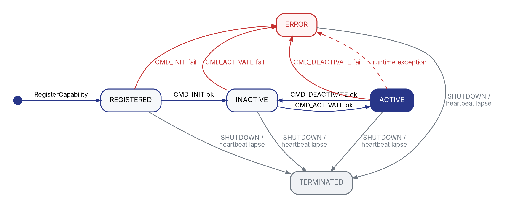

# Robonix 开发者指南

**本指南内容所对应的上游 robonix 仓库 commit**：[`syswonder/robonix:dev@ee7c60f`](https://github.com/syswonder/robonix/commit/ee7c60f)（2026-05-12 dev 分支 HEAD）。

**面向**：写 service / skill / primitive 的开发者。

> **概念**：**原语 / 服务 / 技能** 是三类独立运行的能力提供者（带 lifecycle）；它们对外暴露的 **Capability** 是 contract + transport + endpoint 的接口描述。Python 里就是 `Primitive` / `Service` / `Skill` 三个类。

**阅读路径**：

- **Part I 入门**（§1-§2）：跑通最小部署，建立全局印象
- **Part II 核心概念**（§3-§5）：原语/服务/技能 / 契约 / 生命周期
- **Part III 开发**（§6-§10）：包结构 / API 速览 / 写服务 / 写原语 / 写技能
- **Part IV 部署**（§11-§13）：部署目录 / 部署清单 / 启动
- **Part V 参考**（§14-§16）：Python API / CLI / 配置字段

***

**Part I — 入门**

***

## 1. 5 分钟上手

**前置**：Rust 1.86+（含 cargo，确保 `~/.cargo/bin` 在 `PATH`，没装就 `source ~/.cargo/env`）/ Python 3.10+ / Docker / `uv`。

```bash
# 1. 装工具链
git clone --recurse-submodules https://github.com/syswonder/robonix
cd robonix/rust && make install
rbnx --version

# 2. 克隆部署模板
git clone https://github.com/enkerewpo/template_rbnx ~/my_deploy
cd ~/my_deploy

# 3. VLM 凭据（pilot 用）
export VLM_API_KEY=sk-...
export VLM_BASE_URL=https://api.openai.com/v1
export VLM_MODEL=gpt-4o-mini

# 4. build + boot
rbnx build && rbnx boot
```

`rbnx boot` 跑完停在 `✓ N component(s) up`。开新终端：

```bash
rbnx caps -v          # 4 system + mock_chassis / my_navigate / say_hello
rbnx chat             # 试 "say hello to alice"
```

`Ctrl-C` 杀 `rbnx boot`，所有能力提供者自动清理并退出。跑通后跳 §8 写自己的服务，或 §2 看整体设计。

***

## 2. Robonix 是什么

机器人系统的功能天然分散——驱动、SLAM、导航、决策各是一个独立单元，需要互相发现、调用、可独立替换。Robonix 给这套协调一个最小骨架：**三类能力提供者（原语 / 服务 / 技能）+ 一个目录服务（atlas）+ 一份接口形状（contract）**。

```
       skill        explore / say_hello / ...
         |          (LLM-triggered tasks)
         v
       service      mapping / nav / scene / memory
         |          (robot-level algorithms)
         v
       primitive    chassis / camera / lidar / audio
                    (1 物理设备 = 1 primitive)
```

**几个核心机制**协同工作（详见 Part II）：

* **原语 / 服务 / 技能**：三类独立运行的能力提供者，Python 里写为 `Primitive(id, ns)` / `Service(...)` / `Skill(...)`，挂 lifecycle、装饰器、对外暴露若干 Capability。
* **Capability**：能力提供者对外暴露的一条接口（contract + transport + endpoint）。一个能力提供者可同时暴露多条（`tiago_camera` → `rgb` + `depth` + `extrinsics`）。
* **Atlas**：能力提供者启动时把"我是谁、暴露什么、在哪"注册过来；别人通过它发现 + 寻址。**没有 Atlas 就要硬编码地址**。
* **Contract**：Capability 的形状（toml + ROS IDL）。换实现不动契约。

剩下的章节都是落地细节。Robonix 内部还跑 pilot / executor / liaison 等系统服务。

> **Robonix 是 EAIOS（Embodied AI Operating System）v0.1 白皮书的开源参考实现**。

***

**Part II — 核心概念**

***

## 3. 原语 / 服务 / 技能 与 Capability

### 3.1 三类能力提供者

| 类型 | namespace 前缀（例） | 定义 |
|---|---|---|
| primitive（原语）| `robonix/primitive/<kind>` | 对单一物理设备的硬件抽象，封装其不可再分解的原子操作集。`<kind>` ∈ {`audio`, `camera`, `chassis`, `lidar`}（封闭）|
| service（服务）| `robonix/service/<x>` | 由操作系统统一注册、调度与管理的标准化功能模块 |
| skill（技能）| `robonix/skill/<x>` | 封装特定语义功能的可复用行为序列，由 LLM / 状态机触发 |

第三方实验可用 `myorg/...` 自前缀，atlas 不强制 `robonix/`。`robonix/system/` 是 robonix 自带组件保留前缀。

### 3.2 定义

| | 含义 | Python | 生命周期 |
|---|---|---|---|
| 原语 / 服务 / 技能 | 一个独立运行的能力提供者 | `service = Service(id="my_navigate", namespace=...)` | `REGISTERED → INACTIVE → ACTIVE → ...`（见 §5）|
| Capability | 能力提供者暴露的一条接口 `(contract_id, transport, endpoint, params, description)`，Pilot 大模型在 prompt 里看到的就是这些 | `@service.mcp(...)` / `@service.grpc(...)` / `service.declare_ros2_topic(...)` 等装饰器/方法 | 跟随能力提供者 |

`id` 是该能力提供者在 atlas 里的唯一 id（`audio_driver` / `tiago_chassis` / `my_navigate`）；Capability 没有自己的 id，只通过 `(provider_id, contract_id)` 寻址。

### 3.3 包

**静态构建/分发单元**——目录、manifest、（可选）docker。运行时启动为一个能力提供者。

`package.name` 用反向域名（`com.org.foo`）做发布身份；能力提供者 id 是运行时身份，由 Python 源里 `Primitive/Service/Skill(id="...")` 声明。两者不必相同。rbnx boot 在 spawn 包之后 poll atlas 拿到新注册的能力提供者，跟 `robonix_manifest.yaml` 里挂这个包的 `name:` 对账（两处必须一致）。包结构详见 §6。

### 3.4 Atlas 目录服务

中心目录服务（gRPC，端口 `50051`）。能力提供者启动时按 kind 调 `RegisterPrimitive` / `RegisterService` / `RegisterSkill`，之后每条接口调 `DeclareCapability`。其它能力提供者调 `Query`（`ATLAS.query_primitives/_services/_skills`，返回能力提供者记录列表）或 `find_capability`（扁平展开到 Capability 列表）拿 endpoint。Atlas **不传业务数据**，只传"谁在哪里能干什么"。

***

## 4. 契约

### 4.1 定义

原语/服务/技能暴露的细粒度接口。可类比硬件接口规格书：定义"能做什么 + 数据是什么形状"，与具体实现解耦。一条契约由三件东西组成：

| 件 | 文件 | 决定 |
|---|---|---|
| toml | `capabilities/<...>.v1.toml` | 接口 ID + mode + IDL 引用 |
| IDL | `capabilities/lib/<lib_name>/{msg,srv}/<Name>` | 数据类型（ROS IDL，msg/srv 文件） |
| 实现 | python 装饰器 / publisher | 运行时绑定 |

`mode` 决定语义（rpc / topic / streaming），框架据此选 transport。具体编写步骤见 §8.5。

### 4.2 模式（Mode）与传输（Transport）

契约 toml 的 `[mode] type` 描述**抽象语义**（与具体协议无关）；传输是落地协议。一个模式可被多种传输实现。

**抽象 mode**：

| mode | 语义 |
|---|---|
| `rpc` | 单次请求 / 单次响应 |
| `rpc_server_stream` | 请求 → 响应流 |
| `rpc_client_stream` | 请求流 → 响应 |
| `rpc_bidirectional_stream` | 双向流 |
| `topic_out` | 该能力持续 publish 这条 topic |
| `topic_in` | 该能力持续 subscribe 这条 topic（典型：chassis 声明它消费 `Twist` 命令） |

**transport × mode 兼容矩阵**：

| mode \ transport     | gRPC | ROS 2 | MCP |
|---                   |:---:|:---:|:---:|
| `rpc`                | ✓ | ✓ ¹ | ✓ |
| `rpc_server_stream`  | ✓ | ✗ | ✗ |
| `rpc_client_stream`  | ✓ | ✗ | ✗ |
| `rpc_bidirectional_stream`    | ✓ | ✗ | ✗ |
| `topic_out`          | ✓ ² | ✓ | ✗ |
| `topic_in`           | ✓ ² | ✓ | ✗ |
| **endpoint 形式**    | `host:port` | topic 名 + QoS | HTTP URL |

¹ ROS 2 通过 service 实现 rpc，请求/响应一对一。
² gRPC 上的 `topic_*` = 用 server/client streaming 把"持续 publish/subscribe"伪装成一次性 RPC——典型用途是跨网络 / 跨语言、ROS 2 不可达时的退路。

**为什么是 `topic_in` / `topic_out`、不是无方向的 `topic`**

后缀刻画的是**声明者（能力提供者）的角色**，不是数据的物理流向：

* `topic_out` — 能力提供者是 source，consumer 反向拿 endpoint 去 subscribe（典型：lidar 声明 `/scan`）。
* `topic_in` — 能力提供者是 sink，consumer 反向拿 endpoint 去 publish（典型：chassis 声明 `/cmd_vel`）。

去掉方向后会失去两件不可替代的信息：(1) gRPC fallback 的 codegen 没法决定生成 server-stream 还是 client-stream（见上脚注 ²）；(2) consumer 拿到 endpoint 后不知道自己该 pub 还是 sub，atlas 的"指路"语义就缺一半。多对多 pub/sub（`/tf` 这种）的解法是每个 publisher 各自声明一条 `topic_out` Capability，全指同一个 topic 名；不需要新 mode。

**经验法则**：

* LLM 要调的工具 → `rpc` + MCP
* 一般 service ↔ service / skill ↔ service 调用 → `rpc` + gRPC
* 高频流式数据（传感器、控制）→ `topic_out` + ROS 2
* 长时任务进度推送（LLM 不直接消费，但 service 间需要）→ `rpc_server_stream` + gRPC

***

## 5. 生命周期

{width=100%}

### 5.1 状态

| 状态 | 含义 | 可调它的 Capability |
|---|---|---|
| `REGISTERED` | atlas 已建档，但还没初始化 | ✗ |
| `INACTIVE` | 已初始化（参数 / 上游依赖），但热资源未就位 | ✗ |
| `ACTIVE` | 热资源就位，对外服务 | ✓ |
| `ERROR` | handler 返回 `Err()` 或 raise | ✗ |
| `TERMINATED` | 已退出 / 被驱逐——终态 | ✗ |

### 5.2 三类能力提供者的状态迁移

| 能力提供者类型 | boot 后停在哪 | 谁推到 `ACTIVE` |
|---|---|---|
| **Primitive** | `ACTIVE` | rbnx boot 紧跟 `CMD_INIT` 自动续发 `CMD_ACTIVATE` |
| **Service** | `ACTIVE` | 同 primitive |
| **Skill** | `INACTIVE` | executor 在 LLM 首次路由到该 skill 时发 `CMD_ACTIVATE`；idle 后可发 `CMD_DEACTIVATE` 回 `INACTIVE` |

通用规则：

* 任意状态下，handler 返 `Err()` / raise → `ERROR`
* SIGTERM / `CMD_SHUTDOWN` / 心跳 90s 失联 → `TERMINATED`

handler 实现见 §14.3。

***

**Part III — 开发**

***

## 6. 包结构

template\_rbnx 里三个包正好覆盖典型差别。

### 6.1 service 包

```
my_navigate/
├── package_manifest.yaml    包元数据 + 要 declare 的 contract 清单
├── scripts/
│   ├── build.sh             调 rbnx codegen 生 stubs
│   └── start.sh             起能力提供者的命令（python -m my_navigate.main）
└── my_navigate/             放源码的目录，robonix 不关心代码目录结构，直接调用 start.sh
    ├── __init__.py
    └── main.py              ★ 入口：构造能力提供者 + 装饰器
```

**没有 `capabilities/` 子目录**——my\_navigate 要 declare 的 4 条 `robonix/service/navigation/*` contract 已经在 **robonix 源码的全局 `capabilities/`** 里定义好了，本包只是实现它们（详见 §6.4）。

### 6.2 skill 包

```
say_hello/
├── package_manifest.yaml
├── scripts/{build.sh, start.sh}
├── say_hello_skill/
│   ├── __init__.py
│   └── main.py
└── capabilities/                              ★ 包私有 contract 定义
    ├── lib/say_hello/srv/SayHello.srv         ROS IDL 类型
    ├── say_hello.v1.toml                      contract 描述（MCP 工具）
    └── driver.v1.toml                         contract 描述（lifecycle 入口）
```

skill 通常是全新功能，没有现成 contract 可用，所以在自己的 `capabilities/` 里定义。

### 6.3 primitive 包

```
mock_chassis/
├── package_manifest.yaml
├── scripts/{build.sh, start.sh}
└── mock_chassis/
    ├── __init__.py
    └── main.py
```

primitive 包的目录形态和 service 一样。**怎么把硬件 / 厂商 SDK 装起来由开发者自己定**——可以在本地 venv 里跑、也可以让 `start.sh` 调 `docker run` 起容器、也可以 ssh 到机器人主机起。框架不关心实现，只看 `start.sh` 拉起来的进程能不能注册进 atlas。模板里 `mock_chassis` 给了一个走 docker 的例子，仅供参考（包含 `docker/Dockerfile` 等额外文件）。

### 6.4 `package_manifest.yaml`

以 `services/my_navigate/package_manifest.yaml` 为例（注释逐行）：

```yaml
manifestVersion: 1
package:
  name: com.example.template.my_navigate    # 反向域名，发布身份；与运行时 id 是两码事
  version: 0.1.0
  vendor: example
  license: MIT
build: bash scripts/build.sh
start: bash scripts/start.sh
capabilities:                                # 要 declare 的 contract（全 / 本地都可，codegen 合并搜索）
  - name: robonix/service/navigation/driver
  - name: robonix/service/navigation/navigate
  - name: robonix/service/navigation/status
  - name: robonix/service/navigation/cancel
```

skill 会同时引用全局 lifecycle contract 和自定义 contract——见 `skills/say_hello/package_manifest.yaml`。

### 6.5 `capabilities/` 目录

整个系统有**两种** `capabilities/` 目录（robonix 全局只有 1 份；包私有的每个包各 1 份）：

| 位置 | 谁维护 | 装什么 |
|---|---|---|
| `<robonix-repo>/capabilities/` | robonix 上游 | primitive 标准族（chassis/camera/lidar/audio）、所有 system 服务接口、内置共享 service 接口（navigation/map/scene/memory…）、跨包 ROS IDL 类型库（`lib/`）|
| `<your-pkg>/capabilities/` | 你自己 | 该包私有的额外 contract（skill 自定义工具最常见）|

`rbnx codegen` 扫描两种根合并，得到当前包能引用的 contract 全集。合并规则：toml / IDL 同 `id` **包内覆盖全局**（用于本地试改）；包内 `capabilities/lib/` 的 ROS IDL 也对自己可见。

**何时建本地 `capabilities/`**：

| 你要 declare 的 contract | 它在哪 | 要建本地 `capabilities/` 吗？ |
|---|---|---|
| `robonix/primitive/chassis/move` | robonix 全局 | 不需要 |
| `robonix/service/navigation/navigate` | robonix 全局 | 不需要 |
| `robonix/skill/say_hello/say`（自定义 skill 工具）| 没有，自己定义 | **需要** |
| 自家私有 service 接口（暂不上游） | 没有，自己定义 | **需要** |

***

## 7. API 速览

写原语/服务/技能 用的 Python 库就是 `robonix_api`。下面是后续 §8-§10 所有代码示例里会出现的 API，先有印象就行——**完整签名 + 机制 + 多 mode 写法见 §14**。

```python
from robonix_api import Service, Ok, Err, ATLAS
from robonix_api.atlas_types import Transport, Channel
from myorg_mcp import Hello_Request, Hello_Response   # codegen dataclass

service = Service(id="my_service", namespace="robonix/service/myorg")

# Hot resources — only touched between on_activate / on_deactivate.
chassis_ch: Channel | None = None

@service.on_init
def init(cfg: dict):
    # Light: 读 cfg、向 atlas 探活上游；不开连接、不占资源。
    if not ATLAS.find_capability(
        contract_id="robonix/primitive/chassis/move",
        transport=Transport.GRPC,
    ):
        return Err("no chassis candidate online")
    return Ok()

@service.on_activate
def activate():
    # Heavy: 拿上游 endpoint、起线程、加载模型——只有进入 ACTIVE 时才做。
    global chassis_ch
    cap_view = ATLAS.find_unique_capability(
        contract_id="robonix/primitive/chassis/move",
        transport=Transport.GRPC,
    )
    chassis_ch = service.connect_capability(
        cap_view, "robonix/primitive/chassis/move", Transport.GRPC,
    )
    return Ok()

@service.on_deactivate
def deactivate():
    # 对称释放 on_activate 申请的所有资源。
    global chassis_ch
    if chassis_ch is not None:
        chassis_ch.close()
        chassis_ch = None
    return Ok()

@service.mcp("robonix/service/myorg/hello")
def hello(req: Hello_Request) -> Hello_Response:
    """打招呼。docstring 即工具描述，pilot 喂给 LLM。"""
    return Hello_Response(message=f"hello {req.name}")

if __name__ == "__main__":
    service.run()
```

| API | 作用 |
|---|---|
| `service = Service(id, namespace)`（或 `primitive = Primitive(...)` / `skill = Skill(...)`）| 在文件顶部构造一个**全局能力提供者**，承载所有装饰器和方法。三个类按 package 类型选——它们的 lifecycle 语义、可暴露的 contract、executor 调度策略都有差异（详见 §3 / §5）。`id` 是 atlas 里该能力提供者的唯一 id，`namespace` 固定了之后所有接口 `contract_id` 的前缀（如 `namespace=robonix/primitive/chassis`，则之后声明的接口均以 `robonix/primitive/chassis` 开头） |
| `service.run()` | 阻塞主循环：注册到 atlas、起 gRPC + MCP server、心跳、等 SIGTERM |
| `@service.on_init(fn)` | 必填，REGISTERED→INACTIVE；输入配置，返回 Result |
| `@service.on_activate(fn)` | INACTIVE→ACTIVE；必填；无输入，返回 Result |
| `@service.on_deactivate(fn)` | ACTIVE→INACTIVE；必填；无输入，返回 Result |
| `@service.on_shutdown(fn)` | 任意→TERMINATED；可选；无输入，返回 Result |
| `@service.mcp(contract_id, *, name=None, description="")` | 把函数挂成 MCP 工具（LLM 直接调），描述默认取 docstring |
| `@service.grpc(contract_id, *, description="")` | 把函数挂成 gRPC servicer 方法；gRPC 无 docstring 惯例，建议显式传 description |
| `ATLAS.query(*, kind=, id=, contract_id=, …)` | 按条件搜原语/服务/技能记录（kind=UNSPECIFIED 时三类一起返回）|
| `ATLAS.query_primitives/_services/_skills(...)` | `query()` 的 kind 已固定的快捷形式 |
| `ATLAS.find_capability(*, contract_id=, transport=, …)` | 扁平视角——按 contract 搜，返回 `list[Capability]`（每条 Capability 自带 `provider_id` / `provider_kind`）|
| `ATLAS.find_unique_capability(...)` | 同上但断言只有一条；0 或 >1 都 raise（依赖唯一 capability 时用）|
| `service.connect_capability(cap_view, contract_id, transport)` | 用一条 `Capability` 建一条 consumer→提供方的 `Channel` |
| `service.declare_ros2_topic`   | 把一个 ROS 2 topic publisher 在 atlas 里登记为某契约（详见 §14.8） |
| `service.declare_ros2_service` | 把一个 ROS 2 service 在 atlas 里登记为某契约（详见 §14.8） |
| `Ok()` / `Err("...")` | API提供的辅助结果"类型"，能力提供者的 lifecycle handler 返回这两种之一 |

**最小可跑的能力提供者长这样**——三个 lifecycle handler（`on_init` / `on_activate` / `on_deactivate`）必须全写，框架不允许省略：

```python
from robonix_api import Service, Ok

service = Service(id="my_service", namespace="robonix/service/myorg")

@service.on_init
def init(cfg: dict):
    return Ok()

@service.on_activate
def activate():
    return Ok()

@service.on_deactivate
def deactivate():
    return Ok()

if __name__ == "__main__":
    service.run()
```

***

## 8. 服务

按"先 hello、再加上游探活、再加 connect、再加自定义 contract、最后给完整模板"的渐进式样例展开。每一节增量地解释新引入的 API，最后 §8.6 给可直接 copy 的完整 `main.py` + `package_manifest.yaml`。

### 8.1 最小骨架

四步：

1. 复制 `template_rbnx/services/my_navigate/` 到你的部署，改包名
2. 改 `package_manifest.yaml`：`package.name` / `capabilities[]`（只 declare robonix 全局已有的 contract 就不用建本地 `capabilities/`）；改 Python 源里 `Primitive/Service/Skill(id="...")` 的 id 跟 `robonix_manifest.yaml` 该条目的 `name:` 一致
3. 写 `<pkg>/<pkg>/main.py`：按 package 类型构造一个能力提供者（`Primitive` / `Service` / `Skill`）+ lifecycle handlers + 装饰器
4. `bash scripts/build.sh && bash scripts/start.sh`

最小 `main.py`——三个 lifecycle handler 必须全写，哪怕全是空 `Ok()`：

```python
from robonix_api import Service, Ok
from myorg_mcp import Hello_Request, Hello_Response   # codegen 出来的 dataclass

service = Service(id="my_service", namespace="robonix/service/myorg")

@service.on_init
def init(cfg: dict):
    return Ok()

@service.on_activate
def activate():
    return Ok()

@service.on_deactivate
def deactivate():
    return Ok()

@service.mcp("robonix/service/myorg/hello")
def hello(req: Hello_Request) -> Hello_Response:
    return Hello_Response(message=f"hello {req.name}")

if __name__ == "__main__":
    service.run()
```

`service.run()` 阻塞直到 SIGTERM；中间它做完了：atlas 注册 → declare interfaces → 起 gRPC + MCP server → 起心跳。

验证：

```bash
rbnx caps -v | grep my_service
```

### 8.2 atlas 探活

写真实 service 时，`on_init` 一般要先看上游依赖在不在。**按 id 取**：`ATLAS.query(id=...)` 返回一个 list（0 条 = 没有）：

```python
from robonix_api import Service, Ok, Err, ATLAS

@service.on_init
def init(cfg: dict):
    if not ATLAS.query(id="tiago_chassis"):
        return Err("chassis not online")
    return Ok()
```

`Err("...")` 让能力提供者进 `ERROR`，`reason` 写入 `state_detail`，`rbnx caps -v` 看得到。完整 atlas 发现 API（按 contract 搜 / 多能力提供者处理）见 §14.4 / §14.5。

### 8.3 上游 connect

`on_activate` 阶段才做"申请热运行资源"——拿上游 endpoint、起 ROS subscription、加载模型、开线程。**按 contract 搜对应的 Capability**：`ATLAS.find_capability(contract_id=..., transport=...)` 返回 `list[Capability]`；`service.connect_capability(cap_view, contract_id, transport)` 返回一个 `Channel`，里面 `endpoint` 是对方实际地址：

```python
from robonix_api.atlas_types import Transport

chassis_endpoint: str | None = None              # 模块级缓存

@service.on_activate
def activate():
    global chassis_endpoint
    cap_view = ATLAS.find_unique_capability(
        contract_id="robonix/primitive/chassis/move",
        transport=Transport.GRPC,
    )
    with service.connect_capability(
        cap_view,
        "robonix/primitive/chassis/move",
        Transport.GRPC,
    ) as ch:
        chassis_endpoint = ch.endpoint
    return Ok()
```

`with` 块退出时自动 `Disconnect`。`find_unique_capability` 在 0 或 >1 匹配时 raise——依赖唯一 capability 时用它；多能力提供者场景用 `find_capability` 拿 list 自己挑。完整 connect 机制见 §14.6。

### 8.4 资源释放

`on_activate` 申请的资源必须有对称的 `on_deactivate` 释放——否则 executor evict 后再 activate 会泄漏：

```python
@service.on_deactivate
def deactivate():
    global chassis_endpoint
    chassis_endpoint = None
    return Ok()
```

### 8.5 自定义 contract

到 §8.4 为止你只用了 robonix 全局已有的 contract。如果你的 service 要暴露**全新接口**（带自己的 IDL），三步：

**(1) 写 IDL** — 按 ROS IDL（msg / srv 文件）放 `<your-pkg>/capabilities/lib/<lib_name>/{msg,srv}/`：

```
# <your-pkg>/capabilities/lib/myorg/srv/Hello.srv
string name
---
string message
```

`<lib_name>` 是 `lib/` 下第一层子目录名（snake\_case，如 `myorg` / `camera` / `nav_msgs`），codegen 生成的 `<lib_name>_pb2.py` / `<lib_name>_mcp.py` 模块名沿用。同一 `<lib_name>` 下并列 `msg/` 和 `srv/`。`.srv` 中 `---` 上方是 request、下方是 response；`.msg` 无 `---`，整文件即字段列表。

> ⚠️ **streaming mode 字段约束**：`.srv` 流方向那一段必须**恰 1 个字段**（gRPC 一条流只能跑一种 message type）；unary 方向不限。`topic_*` 用 `.msg`，整文件即流元素类型。违反 codegen 直接 bail。
>
> | mode | request 字段数 | response 字段数 |
> |---|:---:|:---:|
> | `rpc` | 任意 | 任意 |
> | `rpc_server_stream` | 任意 | **=1** |
> | `rpc_client_stream` | **=1** | 任意 |
> | `rpc_bidirectional_stream` | **=1** | **=1** |

**(2) 写 toml** — 放 `<your-pkg>/capabilities/` 任意深度子目录（**不能进 `lib/`**）：

```toml
# <your-pkg>/capabilities/myorg/hello.v1.toml
[contract]
id      = "robonix/service/myorg/hello"
version = "1"
kind    = "service"
idl     = "myorg/srv/Hello.srv"   # 相对 lib/ 的路径

[mode]
type = "rpc"                       # 详见 §4.2
```

**(3) 在代码里 declare** — 把 contract\_id 和你的实现绑定：

```python
@service.mcp("robonix/service/myorg/hello")    # contract_id 必须和 toml 的 [contract] id 一致
def hello(req: Hello_Request) -> Hello_Response:
    return Hello_Response(message=f"hi {req.name}")
```

**Codegen 产物**：`bash scripts/build.sh`（包内默认调 `rbnx codegen --mcp`）扫描两种 `capabilities/` 根生成到 `<your-pkg>/rbnx-build/codegen/`：

```
rbnx-build/codegen/
├── proto_gen/
│   ├── robonix_contracts.proto             所有 contract 合成的 proto
│   ├── robonix_contracts_pb2_grpc.py       ★ 所有 contract 的 Stub / Servicer
│   ├── <lib_name>_pb2.py                   每个 lib/ 子目录的 msg 类
│   └── ...
└── robonix_mcp_types/
    └── <lib_name>_mcp.py                   每个 lib/ 子目录的 dataclass（@service.mcp 用）
```

**名字映射规则**：

| 源 | 生成的名字 |
|---|---|
| **msg 文件**：`lib/<lib_name>/msg/Foo.msg` | gRPC：`<lib_name>_pb2.Foo`<br/>MCP：`<lib_name>_mcp.Foo` |
| **srv 文件**：`lib/<lib_name>/srv/Hello.srv` | gRPC：`<lib_name>_pb2.Hello_Request` / `Hello_Response`<br/>MCP：`<lib_name>_mcp.Hello_Request` / `Hello_Response` |
| **contract id**：`robonix/service/myorg/hello`（其 toml 引用 `myorg/srv/Hello.srv`） | gRPC service：`RobonixServiceMyorgHello`<br/>Servicer：`robonix_contracts_pb2_grpc.RobonixServiceMyorgHelloServicer`<br/>Stub：`robonix_contracts_pb2_grpc.RobonixServiceMyorgHelloStub`<br/>方法名：`Hello`（按 IDL srv 文件名去 `.srv`） |
| **contract id**：`mycomp/a/b/c` | gRPC service：`MycompABC`<br/>规则一致：每段按 `/` 切，段内 snake\_case 转 PascalCase |

**在代码里 import 这些生成产物**：`from robonix_api import ...` 的那一刻，框架自动把 `<pkg>/rbnx-build/codegen/proto_gen` 和 `robonix_mcp_types` 加进 `sys.path`，所以**不需要 `sys.path.insert`**——直接和 robonix\_api 一起在文件顶部 import：

```python
from robonix_api import Service, Ok, Err, ATLAS
from robonix_api.atlas_types import Transport

from navigation_mcp import (              # MCP dataclass：用作 @service.mcp 函数签名
    Navigate_Request, Navigate_Response,
)
import chassis_pb2_grpc                   # gRPC stub：用作 service.connect 拿到 endpoint 后建 client
import chassis_pb2                        # gRPC 消息类

service = Service(id="my_navigate", namespace="robonix/service/navigation")
```

在 service / skill 里：你**消费**的 contract 来自上游 Capability → 用 `service.connect_capability(...)` + 上面 import 的 `chassis_pb2_grpc.RobonixPrimitiveChassisMoveStub`。你**提供**的 contract → 用装饰器 `@service.mcp(...)` / `@service.grpc(...)`，签名里类型注解用 `<lib_name>_mcp` 里的 dataclass（MCP）或 `<lib_name>_pb2` 里的消息类（gRPC）。

### 8.6 完整模板

把 §8.1-§8.5 学到的合在一起——直接对接 robonix 全局的 `service/navigation/*` contract（不需要写自己的 IDL）。`my_navigate/main.py`：

```python
# SPDX-License-Identifier: MulanPSL-2.0
"""my_navigate — minimal service.

- 暴露 robonix 全局的 service/navigation/navigate 这条 MCP 工具
- on_init 阶段在 atlas 里查 chassis primitive 是否在线
- on_activate 阶段拿一条 chassis/move 的 gRPC channel 留着发命令用
"""
from __future__ import annotations
import logging
import uuid

from robonix_api import Service, Ok, Err, ATLAS
from robonix_api.atlas_types import Transport
# Navigate_Request / Navigate_Response 是 codegen 从 robonix 全局的
#   lib/navigation/srv/Navigate.srv 生成的 dataclass：
#   geometry_msgs/PoseStamped goal     ← 请求
#   ---
#   bool   accepted                    ← 响应
#   string goal_id
#   string status_message
from navigation_mcp import Navigate_Request, Navigate_Response

# (1) 构造能力提供者：id 是 atlas 里该能力提供者的唯一 id，namespace 是要 declare 的 contract 公共前缀
service = Service(
    id="my_navigate",
    namespace="robonix/service/navigation",   # 复用 robonix 全局 navigation 命名空间
)

log = logging.getLogger("my_navigate")
chassis_endpoint: str | None = None              # 模块级缓存

# (2) lifecycle: REGISTERED -> INACTIVE
@service.on_init
def init(cfg: dict):
    """解析 config + 验证上游依赖。返回 Ok / Err。"""
    log.info("init cfg=%s", cfg)
    if not ATLAS.query(id="tiago_chassis"):
        return Err("chassis not online")
    return Ok()

# (3) lifecycle: INACTIVE -> ACTIVE（申请热资源）
@service.on_activate
def activate():
    global chassis_endpoint
    cap_view = ATLAS.find_unique_capability(
        contract_id="robonix/primitive/chassis/move",
        transport=Transport.GRPC,
    )
    with service.connect_capability(
        cap_view,
        "robonix/primitive/chassis/move",
        Transport.GRPC,
    ) as ch:
        chassis_endpoint = ch.endpoint
    return Ok()

# (4) lifecycle: 回到 INACTIVE（释放热资源）
@service.on_deactivate
def deactivate():
    global chassis_endpoint
    chassis_endpoint = None
    return Ok()

# (5) 暴露 MCP 工具——docstring 即工具的自然语言描述，pilot 喂给 LLM。
@service.mcp("robonix/service/navigation/navigate")
def navigate(req: Navigate_Request) -> Navigate_Response:
    """把底盘开到 goal 指定的 map 系位姿。LLM 决定调用时机；返回 goal_id
    供后续 query / cancel 用。"""
    pos = req.goal.pose.position
    goal_id = str(uuid.uuid4())
    log.info("navigate accepted goal=%s target=(%.2f, %.2f)", goal_id, pos.x, pos.y)
    # 实际规划逻辑：通过 chassis_ch 发 gRPC 命令到底盘 primitive ……
    return Navigate_Response(
        accepted=True,
        goal_id=goal_id,
        status_message="stub planner accepted goal",
    )

# (6) 阻塞主循环：注册 + declare + listen + heartbeat 全在里面
if __name__ == "__main__":
    service.run()
```

配套 `package_manifest.yaml`（不需要本地 `capabilities/`，全用 robonix 全局 contract）：

```yaml
manifestVersion: 1
package:
  name: com.org.my_navigate
  version: 0.1.0
build: bash scripts/build.sh
start: bash scripts/start.sh
# 全部从 robonix 全局 capabilities/ 引用，自己不再 declare 新 contract
capabilities:
  - name: robonix/service/navigation/driver
  - name: robonix/service/navigation/navigate
  - name: robonix/service/navigation/status
  - name: robonix/service/navigation/cancel
```

每个 API 的详细签名 + 用法见 §14。

***

## 9. 原语

primitive 对应一个物理设备（一个相机、一个底盘、一台麦克风）。和 service 大体相同，差别如下：

* `namespace = "robonix/primitive/<kind>"`，`<kind>` ∈ {`audio`, `camera`, `chassis`, `lidar`}（封闭）
* **"能力提供者 id = device id" 约定**：一个设备一个 primitive。3 个相机 → 3 个 primitive 能力提供者（`tiago_camera_front` / `tiago_camera_left` / `tiago_camera_right`）
* 怎么打包（本地 venv / docker / ssh 到机器人主机）由 `scripts/start.sh` 决定——框架只看能力提供者进程能不能注册进 atlas。`template_rbnx/primitives/mock_chassis/` 给了一个 docker 例子。

**典型 lifecycle**（三个 handler 全必填，跟 service/skill 一致）：

```python
primitive = Primitive(id="my_lidar", namespace="robonix/primitive/lidar")

@primitive.on_init
def init(cfg: dict):
    # 轻量校验：cfg 字段、上游存在性
    return Ok()

@primitive.on_activate
def activate():
    # 起 rclpy node、加载模型、打开硬件 fd、起控制线程；同时 primitive.declare_ros2_topic / declare_ros2_service 把
    # 暴露的 ROS topic 注册到 atlas（详见 §14.8）
    return Ok()

@primitive.on_deactivate
def deactivate():
    # 关 rclpy node / 关硬件 fd / 停控制线程；on_activate 申请的所有热资源在这里对称释放
    return Ok()
```

声明 ROS topic 接口的写法见 §8.5 + §14.8。

***

## 10. 技能

skill = 一段被 LLM / 状态机触发的复合任务。和 service 不同点：

* `namespace = "robonix/skill/<x>"`
* **必须实现 `@skill.on_activate` + `@skill.on_deactivate`**——它们是 executor 控制资源占用的入口，必然成对（eviction 策略可能反复 cycle）
* skill boot 后停在 `INACTIVE`；首次 LLM 调用时 executor 发 `CMD_ACTIVATE` 推到 `ACTIVE`
* skill 通常通过 `@skill.mcp` 暴露工具

**硬性规定：每个原语 / 服务 / 技能必须有 `driver.v1.toml`，无例外**——lifecycle 入口由这条 contract 描述，缺了 `rbnx boot` 没法发 `CMD_INIT` / `CMD_ACTIVATE`，executor 也没法路由 skill 激活命令。

**framework 怎么找 driver**：能力提供者启动时按 `f"{self.namespace}/driver"` 自动向 atlas declare 这条接口（`capability.py:698`）；`rbnx boot` / executor / atlas 反向查找时只看一条规则——**该能力提供者的 interface 列表里 `contract_id` 以 `/driver` 结尾的那一条**（`run_package.rs:722` 等多处用 `ends_with("/driver")`）。也就是说，**contract id 的整体格式 robonix 不强制**——`myorg/aaa/bbb/...` 也行；强制的只是"该能力提供者 namespace 下必须有且只有一个 leaf 叫 `driver`"。

skill 没有现成的 driver contract 可借用，必须自己写一份；**最快做法是从任意 primitive / service 的 `driver.v1.toml` 复制过来，把 `[contract].id` 改成 `<你 skill 的 namespace>/driver`**——namespace 必须和 `Skill(id=..., namespace=...)` 里写的完全一致，否则 codegen 算出的 gRPC service name 和 runtime declare 的对不上：

```toml
# capabilities/driver.v1.toml
[contract]
id      = "<your-namespace>/driver"     # ← 必须 = Primitive/Service/Skill(...) 的 namespace + "/driver"
version = "1"
kind    = "skill"                        # ← primitive / service / skill 据实填
idl     = "lifecycle/srv/Driver.srv"

[mode]
type = "rpc"
```

`idl` 一律指向框架自带的 `lifecycle/srv/Driver.srv`，不要自创——所有能力提供者共享这一个 lifecycle 接口。`kind` 字段会被 atlas 用于 `rbnx caps` 的分类显示和 executor 的策略判断。

**标准模式**：

```python
skill = Skill(id="myskill", namespace="robonix/skill/myskill")

@skill.on_init
def init(cfg: dict):
    recs = ATLAS.find_capability(contract_id="robonix/service/navigation/navigate")
    if not recs:
        return Err("navigation service not found")
    return Ok()

@skill.on_activate
def activate():
    # spawn controller thread, load state machine
    return Ok()

@skill.on_deactivate
def deactivate():
    # release threads, unsubscribe
    return Ok()

@skill.mcp("robonix/skill/myskill/run")
def run(req):
    ...
```

***

**Part IV — 部署**

***

## 11. 部署目录

> 本部分通过 `template_rbnx` 这个最小部署模板把目录、manifest、契约的关系讲清。读完你应该能看懂一个部署的所有文件。

`template_rbnx` 是一个"空部署模板"：[`enkerewpo/template_rbnx`](https://github.com/enkerewpo/template_rbnx)。建议下面的章节边读边对着看真实文件。

```
template_rbnx/
├── robonix_manifest.yaml      ★ 部署入口：rbnx boot 读这个，声明用哪些原语 / 服务 / 技能、各自的包在哪里、启动时的 config 参数（喂给 @service.on_init）
├── primitives/
│   └── mock_chassis/          一个 primitive 包（能力提供者 id = mock_chassis，由其 main.py 的 Primitive(id=...) 声明）
├── services/
│   └── my_navigate/           一个 service 包（能力提供者 id = my_navigate）
└── skills/
    ├── capabilities/
    │   ├── lib/                   契约的 IDL 文件
    │   ├── say_hello.v1.toml      契约定义
    │   └── driver.v1.toml
    └── say_hello/             一个 skill 包（能力提供者 id = say_hello）
```

`primitives/` / `services/` / `skills/` 是约定的子目录名，内部必须是若干个标准 Robonix 包的目录，`robonix_manifest.yaml` 里给每个包写 `path:` 显式指明所处的目录。

每个包内部长什么样见 §6 包结构。

***

## 12. 部署清单

`robonix_manifest.yaml` 是一个 robonix 部署的入口文件——`rbnx boot -f robonix_manifest.yaml` 读它来决定起哪些 system 服务、哪些 primitive / service / skill，以及给每个能力提供者喂什么配置。

**结构**：

```yaml
manifestVersion: 1
name: my-robot                       # 部署名（任意）

env:                                 # 可选：部署级 env（一般留空，env 在外层 export）

# ─── system: robonix 自带的系统组件 ───
# key 是固定的 system 服务名（atlas/executor/pilot/liaison/nexus/memory/scene/speech），
# value 是它的配置块；保持原样的层级会被 JSON 化喂给能力提供者的 on_init(cfg)。
system:
  atlas:
    listen: 127.0.0.1:50051
    log: info
  executor:
    listen: 127.0.0.1:50061
    log: info
  pilot:
    listen: 127.0.0.1:50071
    log: info
    vlm:
      upstream: ${VLM_BASE_URL}      # ${...} 会在加载时展开成环境变量
      api_key: ${VLM_API_KEY}
      model: ${VLM_MODEL}
  liaison:
    listen: 127.0.0.1:50081
    log: info
  memory:
    backend: sqlite
  scene:
    log: info

# ─── primitive: 设备包列表（每条 = 一个物理设备的 primitive） ───
primitive:
  - name: tiago_chassis              # 必须等于该包 Python 源里 Primitive/Service/Skill(id="...") 的 id
    path: ./primitives/tiago_chassis # 相对部署根的本地路径
    config:
      can_port: /dev/can0            # 整段 config 会以 JSON 传给 on_init(cfg)
      odom_frame: odom

# ─── service: 算法 / 应用层服务 ───
service:
  - name: simple_nav                 # 本地包
    path: ./services/simple_nav
    config:
      max_linear: 0.5

  - name: mapping                    # 远程 git 包：rbnx build 阶段克隆到 rbnx-boot/cache/
    url: https://github.com/enkerewpo/mapping_rbnx
    branch: main
    config:
      algo: rtabmap

# ─── skill: LLM/状态机触发的复合任务 ───
skill:
  - name: explore
    url: https://github.com/enkerewpo/explore_rbnx
    branch: main
    config:
      timeout_s: 600
```

字段速查见 §16。

***

## 13. 启动

**`rbnx boot -f robonix_manifest.yaml`** 顺序：

1. 加载 manifest，展开 `${...}` 环境变量
2. 起 `system:` 下声明的所有 system 服务
3. 按 `primitive` → `service` → `skill` 顺序起每个用户包：spawn 后 poll atlas 拿到新注册的能力提供者，跟 manifest 该条目 `name:` 对账（不一致直接 fail），然后 `Driver(CMD_INIT, config_json)` → `on_init(cfg)` → 对 primitive/service 紧跟 `CMD_ACTIVATE` 推到 `ACTIVE`（skill 停 `INACTIVE` 等 executor）
4. 全部就绪后阻塞，`Ctrl-C` 反向 teardown

**约定**：

* **同一层级内顺序起**：service/skill 不解析依赖；要让 mapping 在 simple\_nav 之前起就写前面。
* **config 直传**：yaml 里 `config: { max_linear: 0.5 }` → `on_init(cfg)` 拿到 `cfg["max_linear"] == 0.5`，嵌套结构原样保留。
* **`name:` 必须等于 Python 源里 `Primitive/Service/Skill(id=...)` 的 id**——boot 时 atlas 对账，不一致就退出。

**单包调试**：跳过 manifest 直接起一个：

```bash
rbnx start -p ./services/simple_nav -c local_config.yaml
rbnx start -p ./services/simple_nav -s max_linear=0.3 -s pid_linear=[1,0,0.1]
```

`-c` 跟一个 yaml 文件，整段当 config；`-s key=value` 单字段覆盖。最终都是以 JSON 喂给 `on_init(cfg)`。

***

**Part V — 参考**

***

## 14. Python API

`robonix_api` 是写原语 / 服务 / 技能的核心库——三个类 + 一组装饰器 + `Result` 类型 + `ATLAS` 客户端。每个 API 给出**签名、参数、返回、机制、示例**。

> 本节是 v0.1 发版前的 API 规划。dev 上已经按这套形态推进，签名 / 命名 / 默认值在正式发版前仍可能微调。

### 14.0 总表

```python
from robonix_api import Service, Ok, Err, ATLAS   # 或 Primitive / Skill
from robonix_api.atlas_types import Transport, Capability
```

> 签名里的 `*` 是 keyword-only 标志——`*` 之后的参数必须用 `name=value` 传，不能按位置传。

| API | 用途 |
|---|---|
| `Primitive(id, namespace)` / `Service(...)` / `Skill(...)` | 构造一个能力提供者（按 package 类型选——三类的 lifecycle / 调度策略 / 可暴露的 contract 都有差异，详见 §3 / §5）|
| `service.run()` | 阻塞主循环；注册 + listen + 心跳 + 等 SIGTERM |
| `@service.on_init(cfg) -> Result` | REGISTERED → INACTIVE，必填 |
| `@service.on_activate() -> Result` | INACTIVE → ACTIVE，必填 |
| `@service.on_deactivate() -> Result` | ACTIVE → INACTIVE，必填 |
| `@service.on_shutdown() -> Result` | 任意 → TERMINATED，可选 |
| `Ok()` / `Err("reason")` | lifecycle handler 返回值 |
| `ATLAS.query(*, kind=…, id=…, contract_id=…, namespace_prefix=…, transport=…)` | 搜能力提供者记录 |
| `ATLAS.query_primitives/_services/_skills(...)` | `query()` 已固定 kind 的快捷形式 |
| `ATLAS.find_capability(*, contract_id=…, transport=…, provider_kind=…, provider_id=…, namespace_prefix=…)` | 按 contract 搜，返回 `list[Capability]` |
| `ATLAS.find_unique_capability(*, contract_id=…, ...)` | 同上但断言只有一条；0 或 >1 都 raise |
| `service.connect_capability(cap_view, contract_id, transport)` | 用一条 Capability 建 consumer → 提供方 `Channel` |
| `@service.mcp(contract_id, *, name=None, description="")` | 把函数挂成 MCP 工具（`mode=rpc`，给 LLM 调）；description 默认取 docstring |
| `@service.grpc(contract_id, *, description="")` | 把函数挂成 contract 对应 gRPC 方法；建议显式传 description |
| `service.declare_ros2_topic` / `declare_ros2_service` | 登记 ROS 2 端点 |

只读属性：`service.id` / `service.namespace` / `service.state`。

### 14.1 `Primitive` / `Service` / `Skill`

三个类构造签名一致：`Primitive(id, namespace)` / `Service(id, namespace)` / `Skill(id, namespace)`。按 package 类型挑一个——三类的 lifecycle / 调度策略 / 可暴露的 contract 都不同（详见 §3 / §5）。通常在模块顶部构造一个全局能力提供者，再用装饰器挂 handler。

| 参数 | 类型 | 必填 | 说明 |
|---|---|---|---|
| `id` | `str` | 是 | 能力提供者 id（atlas 里唯一），必须等于 `robonix_manifest.yaml` 里挂这个包的 `name:`（两处一致）|
| `namespace` | `str` | 是 | 该能力提供者所有 contract 的公共前缀，如 `robonix/service/myorg`。框架要求 contract\_id 以 `<namespace>/` 开头 |

**机制**：构造时只做轻量校验（namespace 非空、包根目录定位、`<pkg>/rbnx-build/codegen/` 加进 `sys.path`）。**不连接 atlas、不开端口**——这些发生在 `service.run()`。

```python
service = Service(id="my_navigate", namespace="robonix/service/myorg")
```

### 14.2 `service.run()`

**阻塞主循环**。`main.py` 最后一行通常就是 `service.run()`，内部按序：

1. 连 atlas + 按 kind 调对应 Register RPC（端口不通 / 重名 id 直接退出）
2. 启 gRPC server（自动选端口），挂 `<namespace>/driver` 生命周期接口 + 所有 `@service.grpc` 业务方法
3. 每条 gRPC contract 调 `DeclareCapability`
4. 有 `@service.mcp` 则起 MCP HTTP server（FastMCP + uvicorn）并 declare
5. 起心跳线程（10s 一次；超 90s 无心跳 atlas 标 TERMINATED）
6. 装 SIGTERM/SIGINT handler，触发时 `on_shutdown` → 停 server → unregister
7. `signal.pause()` 阻塞

跑完 1-5 后 atlas 里只是 `REGISTERED`，等 `Driver(CMD_INIT)` 到达才进 `INACTIVE`——状态推进由 rbnx boot / executor 异步驱动。

### 14.3 lifecycle 装饰器

四个装饰器，对应 §5 的状态迁移。所有 handler 必须返回 `Result`（§14.7）。装饰器只在模块 import 时跑，把 fn 注册到能力提供者的 handler 表里，**不包 wrapper、不改 fn 行为**——保留可单测性。

| 装饰器 | 签名 | 必填 | 该做什么 |
|---|---|---|---|
| `@service.on_init` | `fn(cfg: dict) -> Result` | 是 | 解析 cfg、用 `ATLAS.query`/`find_capability` 探上游。**不申请热资源** |
| `@service.on_activate` | `fn() -> Result` | 是 | 申请热资源——开线程、加载模型、订阅 ROS、打开硬件 fd。**必须可重入**（skill evict 后会再 activate）|
| `@service.on_deactivate` | `fn() -> Result` | 是 | 对称释放 `on_activate` 的热资源；config 和 atlas 注册保留 |
| `@service.on_shutdown` | `fn() -> Result` | 否 | flush 日志、关端口。返回值忽略（能力提供者无论如何都退出） |

`cfg` 来源：`rbnx boot` 时取 `robonix_manifest.yaml` 里该能力提供者的 `config:` 段；`rbnx start -p <pkg> -c local.yaml` 时取 `-c` 文件；都没传则 `{}`。

```python
@service.on_init
def init(cfg: dict):
    if cfg.get("require_camera") and not ATLAS.find_capability(
        contract_id="robonix/primitive/camera/rgb"
    ):
        return Err("camera not online")
    return Ok()

@service.on_activate
def activate():
    global controller
    controller = Controller(...)
    controller.start()
    return Ok()

@service.on_deactivate
def deactivate():
    global controller
    if controller is not None:
        controller.stop()
        controller = None
    return Ok()
```

### 14.4 ATLAS 发现 + connect

`ATLAS` 两种 API：

* `ATLAS.query(*, id=…, kind=…, contract_id=…, …)` —— 能力提供者视角，按 id / kind / contract 搜能力提供者记录。`ATLAS.query_primitives/_services/_skills` 是固定 kind 的快捷形式。
* `ATLAS.find_capability(*, contract_id=…, transport=…, …)` —— 接口视角，返回 `list[Capability]`（自带 `provider_id` / `provider_kind`）。`find_unique_capability` 在 0 或 >1 时 raise，依赖唯一 capability 时用。

`service.connect_capability(cap_view, contract_id, transport)` 用一条 Capability 开 `Channel`，`ch.endpoint` 是对方实际地址。

**典型写法**：

```python
# 默认：全场唯一一个 provider 提供该 contract
cap_view = ATLAS.find_unique_capability(
    contract_id="robonix/primitive/chassis/move",
    transport=Transport.GRPC,
)
with service.connect_capability(cap_view, "robonix/primitive/chassis/move",
                                Transport.GRPC) as ch:
    ...

# 多 provider 时：按 provider_id 自己挑
caps  = ATLAS.find_capability(contract_id="robonix/primitive/camera/rgb")
front = next((c for c in caps if c.provider_id == "tiago_camera_front"), None)
```

### 14.5 atlas-types 数据结构

`ATLAS` 是 module-level singleton（参照 `prometheus_client.REGISTRY` 风格），第一次访问时连到 atlas（端口取 `ROBONIX_ATLAS`，默认 `127.0.0.1:50051`）。

返回的两个 dataclass 都是 frozen，要新数据就重新 query。

**能力提供者记录**（`ATLAS.query / query_primitives / query_services / query_skills` 返回单元）：

| 字段 | 类型 | 说明 |
|---|---|---|
| `id` | `str` | 能力提供者 id（atlas 里唯一）|
| `kind` | `Kind` | `PRIMITIVE` / `SERVICE` / `SKILL` |
| `namespace` | `str` | contract 公共前缀 |
| `state` | `LifecycleState` | §5.1 |
| `state_detail` | `str` | `ERROR` 时为 reason，其它可能为空 |
| `last_heartbeat_ms` | `int` | 上次心跳 unix ms |
| `capability_md_path` | `str` | 注册时报上来的 `CAPABILITY.md` 路径 |
| `capabilities` | `tuple[Capability, ...]` | 该能力提供者已声明的所有 Capability |

**`Capability`**（`ATLAS.find_capability` 返回单元）：

| 字段 | 类型 | 说明 |
|---|---|---|
| `provider_id` | `str` | 暴露这条 capability 的能力提供者 id |
| `provider_kind` | `Kind` | 该能力提供者的 kind |
| `contract_id` | `str` | 接口 id |
| `transport` | `Transport` | gRPC / ROS2 / MCP |
| `params` | `GrpcParams \| Ros2Params \| McpParams` | transport-specific（gRPC service+method / ROS 2 qos\_profile / MCP description+schema）|
| `description` | `str` | 来源合并：contract toml + declare 时传入 + 包根 `CAPABILITY.md`（给 Pilot 看的）|

`Transport` 是 `IntEnum`：`UNSPECIFIED` / `GRPC` / `ROS2` / `MCP`；`Kind` 是 `IntEnum`：`UNSPECIFIED` / `PRIMITIVE` / `SERVICE` / `SKILL`。

#### `ATLAS.query(*, kind, id, contract_id, namespace_prefix, transport)`

```python
[chassis] = ATLAS.query(id="tiago_chassis")              # 按 id（0 或 1）
skills    = ATLAS.query(kind=Kind.SKILL)                 # == query_skills()
recs      = ATLAS.query(contract_id="robonix/primitive/chassis/move",
                        transport=Transport.GRPC)        # 按 contract
```

#### `ATLAS.find_capability(*, contract_id, transport, provider_kind, provider_id, namespace_prefix) -> list[Capability]`

把所有能力提供者的 `capabilities[]` 拉平展开，返回所有匹配的 `Capability`（可能为空）。

`on_init` 里轻量探活最常用：

```python
@service.on_init
def init(cfg):
    if not ATLAS.find_capability(contract_id="robonix/service/map/occupancy_grid"):
        return Err("mapping service not online")
    return Ok()
```

#### `ATLAS.find_unique_capability(*, contract_id, ...) -> Capability`

同 `find_capability`，但 0 或 >1 都 raise `ValueError`，依赖唯一 capability 时用。

### 14.6 `service.connect_capability`

**签名**：`service.connect_capability(cap_view, contract_id, transport) -> Channel`

**打开一条 consumer → 提供方通道，拿到该接口对方的 endpoint。**

| 参数 | 类型 | 说明 |
|---|---|---|
| `cap_view` | `Capability` | 上一步从 `ATLAS.find_capability` / `find_unique_capability` 拿到的那条 |
| `contract_id` | `str` | 要消费的接口 |
| `transport` | `Transport` | 走 gRPC / ROS2 / MCP |

**返回**：`Channel`，关键字段 + 方法：

| 名 | 类型 | 说明 |
|---|---|---|
| `endpoint` | `str` | 对方实际地址（gRPC `host:port` / ROS topic 名 / MCP HTTP URL）|
| `params` | transport-specific | gRPC 的 service+method / ROS 2 的 `qos_profile` / MCP 的 description+schema |
| `channel_id` | `str` | atlas 给的句柄，框架内部追踪用 |
| `close()` | method | 显式 disconnect（idempotent；多次调用安全）|
| `__enter__` / `__exit__` | context manager | `with` 块退出时自动 `close()` |

**机制**：atlas 端记一条 consumer→提供方边（`rbnx channels` 审计 + 心跳追踪），框架维护能力提供者本地 channel 表——`ch.close()` / `Channel.__exit__` / 能力提供者 teardown 都会调 atlas 的 `DisconnectCapability` 删掉对应边。

**两种用法**：

* **短寿命**——`with service.connect_capability(...) as ch:` 块内用 `ch.endpoint`，退出自动 disconnect。
* **长寿命**——`on_activate` 里 `chassis_ch = service.connect_capability(...)` 存到模块级，`on_deactivate` 调 `chassis_ch.close()` 释放（§7 速览例已示）。

框架兜底：忘 `close()` / `with`，teardown 时遍历内部 channel 表 Disconnect 所有未关。但显式 close 才规范——否则 atlas 端 consumer 边一直挂着，影响 `rbnx channels` 审计。

### 14.7 `Result` 类型

lifecycle handler 必须返回两种之一：

| 构造 | 含义 | 后续行为 |
|---|---|---|
| `Ok()` | 成功 | 推进到下一态（CMD\_INIT→INACTIVE 等）|
| `Err("reason")` | 失败 | 进 `ERROR`，`reason` 写入 atlas 的 `state_detail`，`rbnx caps -v` 能看到 |

不返回 `Result`（例如忘了 return）会被框架视作 `Err`；handler 内部 `raise` 也会被捕获转成 `Err(str(exc))`。

```python
return Ok()
return Err("device /dev/ttyUSB0 not found")
```

### 14.8 `service.declare_ros2_topic` / `service.declare_ros2_service`

robonix v1 **不 wrap rclpy**——publisher / subscriber / service / client 直接 `rclpy.init() + Node + create_publisher / create_subscription / create_service + spin`。robonix 只插一个 declare 点告诉 atlas"我在某个 ROS 端点上提供某 contract"，让 consumer 能通过 `ATLAS.find_capability` + `service.connect_capability(transport=ROS2)` 拿到名字 + QoS。

ROS 2 有两类端点，分别对应两个 declare 方法：

| 方法 | 用途 | 对应 contract `mode` |
|---|---|---|
| `service.declare_ros2_topic`   | publish / subscribe 一条 topic | `topic_in` / `topic_out` |
| `service.declare_ros2_service` | 提供一个 ROS 2 service（请求 / 响应一对一） | `rpc` |

> ROS 2 **action**（长任务 + feedback + result）暂不支持。需要的话现在走 `rpc_server_stream` + gRPC（feedback 用 server-stream 推），等后续版本补。

完整签名见下文。

#### `declare_ros2_topic`

```python
service.declare_ros2_topic(
    "robonix/primitive/lidar/lidar3d",
    "/scanner_normalized",
    qos="best_effort",
    description="发布归一化点云（mid360 → robonix lidar3d 契约）",
)
```

| 参数 | 类型 | 说明 |
|---|---|---|
| `contract_id` | `str` | 这个 publisher 满足的 contract |
| `topic` | `str` | ROS topic 名 |
| `qos` | `str` | QoS preset 字符串（见下表，默认 `best_effort`）|
| `description` | `str?` | 这条 capability 的自然语言描述。ROS 2 没有 docstring-as-description 的惯例，建议显式传——三源合并规则同 `@service.mcp`（contract toml + 这里 + `CAPABILITY.md`）|

**QoS preset**（字符串）跟 ROS 2 官方 `rmw` builtin profile 一致：

| 字符串 | reliability / durability / depth | 何时用 |
|---|---|---|
| `"best_effort"` | BEST\_EFFORT / VOLATILE / depth=10 | 默认；可丢但要新鲜的流 |
| `"reliable"` | RELIABLE / VOLATILE / depth=10 | 不允许丢的小流（控制命令、状态变更） |
| `"sensor_data"` | BEST\_EFFORT / VOLATILE / depth=5 | 高频传感器流（lidar 扫描、相机帧）|
| `"latched"` / `"transient_local"` | RELIABLE / TRANSIENT\_LOCAL / depth=1 | 静态信息（地图、相机外参）——晚来的订阅者也能拿到最近一次值 |

#### `declare_ros2_service`

```python
service.declare_ros2_service(
    "robonix/service/navigation/navigate",
    "/navigate_to_pose",
    description="把底盘开到 goal 指定位姿",
)
```

| 参数 | 类型 | 说明 |
|---|---|---|
| `contract_id` | `str` | 该 service 满足的 contract（contract toml 必须 `mode=rpc`）|
| `service` | `str` | ROS 2 service 名 |
| `description` | `str?` | 同 `declare_ros2_topic` |

ROS 2 service 的 QoS 用框架默认（reliable / depth=10），不暴露给开发者。

#### 提供方：rclpy publisher + 一行 declare

```python
import rclpy
from rclpy.node import Node
from sensor_msgs.msg import LaserScan

@service.on_activate
def activate():
    global node, pub
    rclpy.init()
    node = Node("my_lidar_cap")
    pub  = node.create_publisher(LaserScan, "/scanner_normalized", 10)
    service.declare_ros2_topic(
        "robonix/primitive/lidar/lidar3d",
        "/scanner_normalized",
        qos="best_effort",
    )
    threading.Thread(target=lambda: rclpy.spin(node), daemon=True).start()
    return Ok()

# 业务代码里：
pub.publish(scan_msg)
```

#### 消费方：`ATLAS.find_capability` + `service.connect_capability(transport=ROS2)` + rclpy subscription

`service.connect_capability(...)` 拿到的 `Channel.endpoint` 就是 topic 名（或 service 名），`Channel.params.qos_profile` 是 declare 时给的 QoS preset（service 时为空）。

```python
import rclpy
from rclpy.node import Node
from sensor_msgs.msg import LaserScan

@service.on_activate
def activate():
    cap_view = ATLAS.find_unique_capability(
        contract_id="robonix/primitive/lidar/lidar3d",
        transport=Transport.ROS2,
    )
    ch = service.connect_capability(cap_view,
                                "robonix/primitive/lidar/lidar3d",
                                Transport.ROS2)
    rclpy.init()
    node = Node("my_consumer")
    node.create_subscription(LaserScan, ch.endpoint, on_scan,
                             qos_profile=qos_from_str(ch.params.qos_profile))
    threading.Thread(target=lambda: rclpy.spin(node), daemon=True).start()
    return Ok()
```

`qos_from_str(...)` 是项目里几行的 helper（把字符串映射到 `rclpy.qos.QoSProfile`），常见做法是：

```python
from rclpy.qos import qos_profile_sensor_data, qos_profile_system_default
def qos_from_str(s):
    return {
        "best_effort": qos_profile_system_default,
        "reliable":    qos_profile_system_default,
        "sensor_data": qos_profile_sensor_data,
    }.get(s, qos_profile_system_default)
```

**为什么不 wrap rclpy**：ROS 2 是它自己一整套生命周期管理（Context/Executor/Node），robonix wrap 一层只会让用户在两套模型间切换。`declare_ros2_topic` / `declare_ros2_service` 是 robonix 在 ROS 2 路径上**唯一**的介入——告诉 atlas 端点名 + QoS，仅此而已。

### 14.9 `@service.mcp` / `@service.grpc`

#### `@service.mcp(contract_id, *, name=None, description="")` — MCP 工具

把一个普通 Python 函数挂成一条 MCP 工具，pilot / 任何 MCP 客户端都能调到。

**要求**：

* 函数有**类型注解**——参数类型（`req`）+ 返回类型——必须是 codegen 生成的 dataclass（`<pkg>/rbnx-build/codegen/robonix_mcp_types/...`）。FastMCP 用类型注解生成 JSON Schema 给 LLM。
* contract toml 的 `mode` 必须是 `rpc`（其它 mode 会 raise）。

```python
# myorg_mcp 是 robonix_mcp_types/myorg_mcp.py，能力提供者构造时它的目录已加入 sys.path
from myorg_mcp import Hello_Request, Hello_Response

@service.mcp("robonix/service/myorg/hello")
def hello(req: Hello_Request) -> Hello_Response:
    """打招呼。LLM 任何时候想跟人说话都可以调。"""
    return Hello_Response(message=f"hi {req.name}")
```

**description（给 Pilot LLM 看的自然语言）的三源合并**：

1. contract toml 的 `[contract].description`（契约级默认；同一 contract 所有实现共用）
2. **装饰器的 `description=` kwarg；没传就 fallback 到 `fn.__doc__`**（MCP 生态惯例：docstring 即 tool description）
3. 包根的 `CAPABILITY.md`（能力提供者级长文档，整个包共享）

三个都拼给 LLM。最常用就是 docstring——FastMCP 也认；显式覆盖时写 `@service.mcp("...", description="...")`。

codegen 生成的 dataclass 命名是 `<SrvName>_Request` / `<SrvName>_Response`（按 ROS srv 文件名）；msg 文件直接是 `<MsgName>`。每个能力提供者一个 FastMCP HTTP server（自动选端口），所有 `@service.mcp` 都挂在同一 server 上。`name=` 可重命名工具（默认用 contract id 末段）。

#### `@service.grpc(contract_id, *, description="")` — gRPC 方法 handler

把一个 Python 函数挂成 contract 对应 gRPC servicer 的方法实现。

**机制**：codegen 给每条带 gRPC transport 的 contract 生成 `<PascalContractId>Servicer` 抽象类（在 `<pkg>/rbnx-build/codegen/proto_gen/robonix_contracts_pb2_grpc.py`）。装饰器把你的函数包成这个 servicer 的子类，挂到能力提供者共享的 gRPC server 上。**handler 函数的形态由 contract 的 `[mode] type` 决定**——下面这张表列了所有 6 种 mode 对应的 handler 写法。

**description**：gRPC 生态本身没有"docstring 当工具说明"的惯例，建议在装饰器里**显式**传 `description="..."`（不传时框架仍会 fallback 到 `fn.__doc__`，但 gRPC 调用方一般不读 docstring，最好别赖这个）。三源合并规则同 `@service.mcp`（contract toml + 装饰器 `description=` / docstring + `CAPABILITY.md`，三者拼给 Pilot）。

```python
import chassis_pb2  # codegen 出来的 protobuf 类

@service.grpc("robonix/primitive/chassis/move", description="发底盘速度命令，单位 m/s 与 rad/s")
def execute_move_command(req: chassis_pb2.ExecuteMoveCommand_Request, ctx):
    chassis.send_velocity(req.linear_x, req.angular_z)
    return chassis_pb2.ExecuteMoveCommand_Response(ok=True)
```

**handler 参数类型**——robonix 不重新发明，直接套用 grpc-python 上游惯例：

| 名 | 实际运行时类型 | 用法 |
|---|---|---|
| `request` | codegen 生成的 protobuf 消息类的对象，例如 `chassis_pb2.ExecuteMoveCommand_Request`——它继承自 `google.protobuf.message.Message` | 单次请求 mode（`rpc` / `rpc_server_stream` / `topic_out`）。直接 `req.field_name` 读字段 |
| `request_iterator` | `grpc._server._RequestIterator`（grpc-python 内部类）——只用到 sync iterator 协议（`__iter__` + `__next__`）。每次 `next(request_iterator)` 阻塞到下一条消息到达，**返回值是 codegen 出的 protobuf 消息类的对象**（"流元素类型"，由 IDL 决定，详见 §8.5 streaming mode 约束）；客户端关流时 raise `StopIteration` | 请求流 mode（`rpc_client_stream` / `rpc_bidirectional_stream` / `topic_in`）。规范用法：`for chunk in request_iterator: ...`，每个 `chunk` 跟 unary mode 的 `request` 同 Python 类型，只是逐个到达；循环在客户端关流时自动退出 |
| `ctx` | `grpc._server._Context`，公开接口 [`grpc.ServicerContext`](https://grpc.github.io/grpc/python/grpc.html#grpc.ServicerContext) | 常用：`ctx.is_active()` 判客户端是否还连着、`ctx.cancel()` 主动断、`ctx.set_trailing_metadata(...)` 加 trailer、`ctx.peer()` 拿调用方地址 |

**关于 `yield`**：server-stream / bidi-stream / topic_out 三种 mode 的 handler 用 `yield` 而不是 `return`——`yield` 是 Python 关键字，把函数变成**生成器函数**（generator function）。区别：

* 普通函数 `return x`：调用立刻执行到底，返回 `x`。
* 生成器函数 `yield x`：调用**不立刻执行**，返回一个生成器对象。每次外部 `next()` 才执行到下一个 `yield` 把 `x` 送出，函数挂起；`return` 或自然结束即迭代终止。

gRPC 框架自动遍历 handler 返回的 generator，把每个 yield 出的对象塞进响应流。这跟 grpc-python 上游一致，详见官方 [Basics tutorial](https://grpc.io/docs/languages/python/basics/) service-side 章节。

**6 种 mode 的 handler 形态**：

```python
import chassis_pb2          # codegen 生成的消息类
import audio_pb2            # 用 audio 流式接口举例
import std_msgs_pb2         # ack 用 Empty
```

**(1) `rpc` — 一发一收**

```python
@service.grpc("robonix/primitive/chassis/move")
def execute_move_command(req, ctx):
    chassis.send_velocity(req.linear_x, req.angular_z)
    return chassis_pb2.ExecuteMoveCommand_Response(ok=True)
```

handler `(req)` 或 `(req, ctx)`；return 一个 Response。框架按 inspect 自适应。

**(2) `rpc_server_stream` — 一收多发**

```python
@service.grpc("robonix/system/executor/execute")
def execute(req, ctx):
    """收到 Plan，按 step 流式回 CapabilityCallEvent。"""
    for step in req.plan.steps:
        yield executor_pb2.CapabilityCallEvent(call_id=step.call_id, result=run_step(step))
        if not ctx.is_active():
            break
```

每 yield 一个 Response；`return` 或函数结束即关流；`ctx.is_active()` 检查订阅是否还在。

**(3) `rpc_client_stream` — 多收一发**

```python
@service.grpc("robonix/primitive/audio/speaker")
def stream(request_iterator, ctx):
    for chunk in request_iterator:   # 阻塞迭代到客户端 done
        speaker.write(chunk.data)
    return std_msgs_pb2.Empty()
```

第一个参数是迭代器（习惯叫 `request_iterator`），`for chunk in ...` 阻塞到客户端关流，最后 return 一个 Response。

**(4) `rpc_bidirectional_stream` — 多收多发**

```python
@service.grpc("robonix/system/speech/asr_stream")
def asr_stream(request_iterator, ctx):
    decoder = StreamingDecoder()
    for chunk in request_iterator:
        decoder.feed(chunk.data)
        if (partial := decoder.peek()):
            yield asr_pb2.RecognizeStreamEvent(event_type=asr_pb2.PARTIAL, text=partial)
    yield asr_pb2.RecognizeStreamEvent(event_type=asr_pb2.FINAL, text=decoder.finalize())
```

`request_iterator` 进、`yield` 出，**两侧独立异步**，不需要一对一。

**(5) `topic_out` — 持续 publish**

走 gRPC 时 = server streaming：consumer 发 Empty 订阅，能力 `while ctx.is_active(): yield frame`。形态同 (2)，语义是主动持续推。

**(6) `topic_in` — 持续 subscribe**

走 gRPC 时 = client streaming：consumer 发流、能力消费。形态同 (3)，语义是该能力是 sink。

**`topic_*` 走 ROS 2 transport 时不用 `@service.grpc`**——见 §14.8 `service.declare_ros2_topic` + 用户自管的 rclpy publisher/subscription。`topic_*` 只在该 contract 想跨语言或穿 docker 网络时才走 gRPC。

### 14.10 只读属性

| 属性 | 用途 |
|---|---|
| `service.id` | 构造时给的能力提供者 id |
| `service.namespace` | 构造时给的 namespace |
| `service.state` | 当前 lifecycle 状态（`LifecycleState` 枚举）|

***

## 15. CLI

`rbnx build` / `rbnx clean` 在**部署根目录**（含 `robonix_manifest.yaml`）和**单包目录**（含 `package_manifest.yaml`）下行为不同——参考下面的"工作目录"列。

| 子命令 | 工作目录 | 作用 |
|---|---|---|
| `rbnx --version` | 任意 | 版本 |
| `rbnx path <key>` | 任意 | 查 robonix 子树（`root` / `rust` / `capabilities` / `interfaces-lib` / `robonix-api`） |
| `rbnx codegen [--mcp]` | 单包 | 给当前 package 生 proto stubs / MCP dataclass 到 `<pkg>/rbnx-build/codegen/` |
| `rbnx build` | 部署根 | 遍历 manifest 里所有 primitive/service/skill，依次跑各包的 `package_manifest.build` |
| `rbnx build` | 单包 | 跑当前包的 `package_manifest.build` |
| `rbnx clean` | 部署根 | 清整套部署的 `rbnx-build/` + `rbnx-boot/cache/` |
| `rbnx clean` | 单包 | 只清当前包的 `rbnx-build/` |
| `rbnx clean --cache` | 部署根 | 同上 + 也清 `rbnx-boot/cache/` 里克隆下来的远程包 |
| `rbnx start -p <pkg> [-c <yaml>] [-s k.v=val]` | 任意 | 单包启动（开发用），跳过 manifest |
| `rbnx boot -f <manifest.yaml>` | 部署根 | 起整套部署 |
| `rbnx shutdown -f <manifest.yaml>` | 部署根 | 拆 boot（pkill + docker 清理） |
| `rbnx caps [-v]` | 任意 | 看 atlas 当前能力提供者列表 |
| `rbnx contracts [-p <prefix>]` | 任意 | 看 atlas 已知的 contract registry |
| `rbnx ask "<prompt>"` | 任意 | 单次 LLM 提问（走 pilot） |
| `rbnx chat` | 任意 | 交互式对话（走 liaison） |

***

## 16. 配置字段

### 16.1 `package_manifest.yaml`

| 字段 | 类型 | 必填 | 说明 |
|---|---|---|---|
| `manifestVersion` | int | 是 | 当前 `1` |
| `package.name` | string | 是 | 反向域名 |
| `package.version` | string | 是 | semver |
| `package.vendor` | string | 否 | |
| `package.license` | string | 否 | SPDX |
| `build` | string | 是 | shell 命令 |
| `start` | string | 是 | shell 命令 |
| `capabilities[]` | list | 是 | `[{name: "robonix/.../X"}]` |

### 16.2 `robonix_manifest.yaml`

顶层字段：

| 字段 | 类型 | 说明 |
|---|---|---|
| `manifestVersion` | int | `1` |
| `name` | string | 部署名（任意） |
| `env` | object | 部署级环境变量（一般留空） |
| `system` | map | system 服务的配置块；key 是固定 system 名（atlas/executor/pilot/liaison/nexus/memory/scene/speech…），value 透传给该 system 服务的 on\_init |
| `primitive` | list | primitive 包列表 |
| `service` | list | service 包列表 |
| `skill` | list | skill 包列表 |

`primitive` / `service` / `skill` 列表中**每个条目**：

| 字段 | 类型 | 说明 |
|---|---|---|
| `name` | string | **必须等于该包 Python 源里 `Primitive/Service/Skill(id="...")` 的 id**（rbnx boot 用这个对账，不一致会失败）|
| `path` | string | 本地包目录（相对部署根） — 与 `url` 二选一 |
| `url` | string | 远程 git 仓库；`rbnx build` 阶段克隆到 `rbnx-boot/cache/` |
| `branch` | string | 远程包分支；与 `url` 配套 |
| `config` | object | 整段以 JSON 化形式喂给该包的 `on_init(cfg)` |

启动顺序：`system` 区块先按固定顺序起 → 然后 `primitive` → `service` → `skill`，**每段内部按 manifest 写入顺序**。当前 dev 不解析跨条目的 `depends_on`；要让 A 先于 B 起就把 A 写在前面。

### 16.3 contract toml

| 字段 | 说明 |
|---|---|
| `[contract] id` | 接口 ID，全局唯一 |
| `[contract] version` | 字符串，从 `"1"` 起 |
| `[contract] kind` | `primitive` / `service` / `skill` |
| `[contract] idl` | 引用 IDL 文件，相对 `lib/` 根，例如 `chassis/srv/Move.srv` 或 `nav_msgs/msg/Odometry.msg` |
| `[contract] description` | 契约级默认描述（自然语言）。declare 时若不另传 / 不写 docstring，consumer 端 fallback 到这条；详见 §14.9 三源合并 |
| `[mode] type` | `rpc` / `rpc_server_stream` / `rpc_client_stream` / `rpc_bidirectional_stream` / `topic_in` / `topic_out` |

